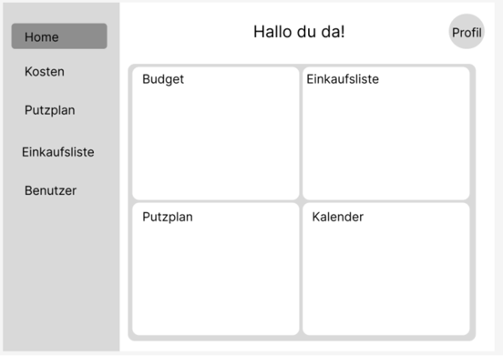
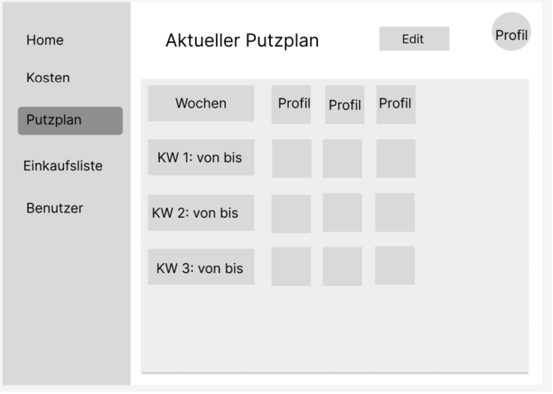
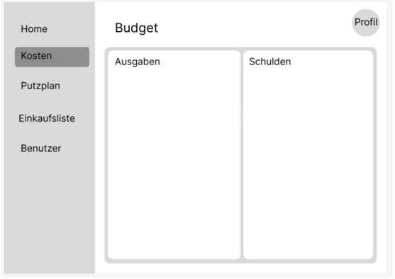
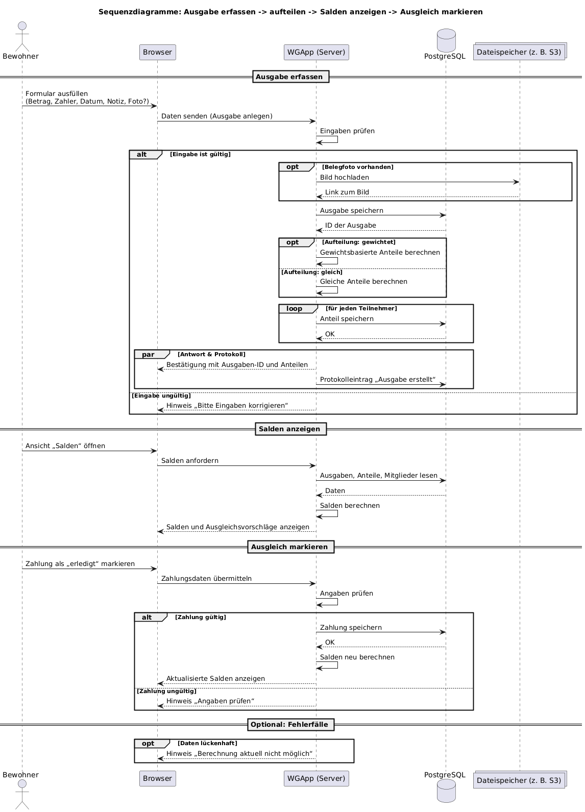
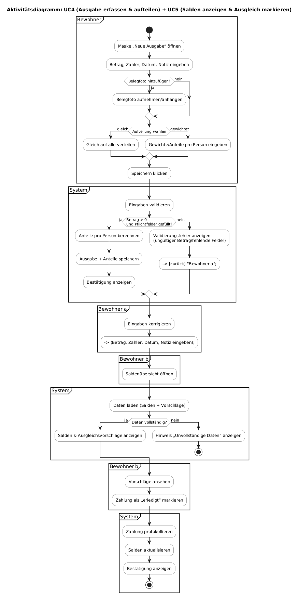
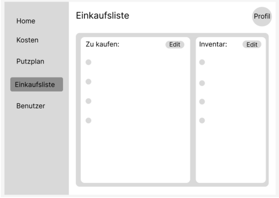
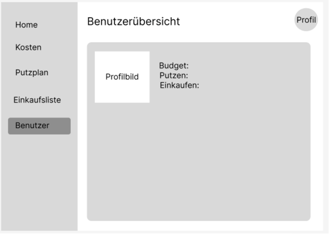
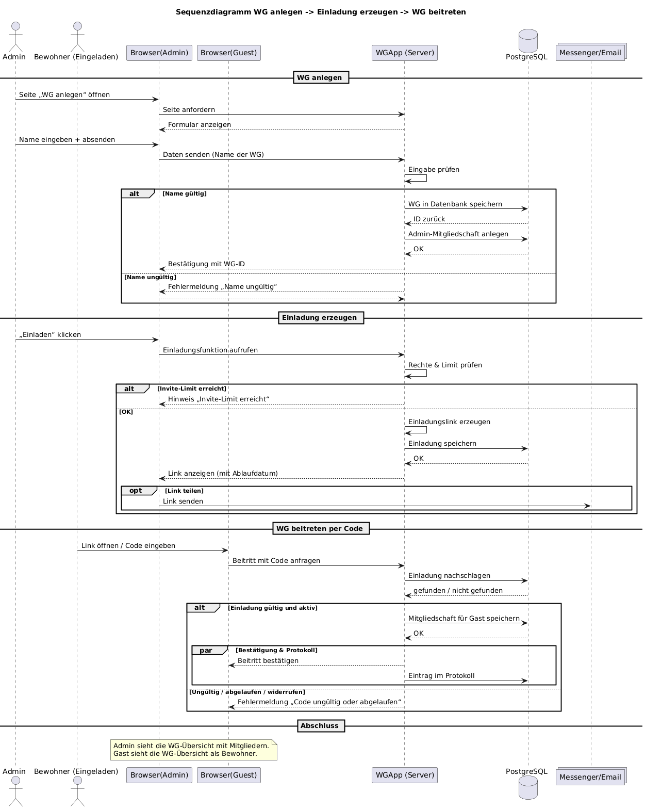

# FlatMate
## Softwareanforderungen
> Bei dieser Vorlage handelt es sich um eine vereinfachte Version, die auf den Dokumentationsvorlagen von IBM Rational Unified Process (RUP) basiert.

### 1. Einleitung

#### 1.1 Übersicht
> Was sind die Verkaufsargumente bzw. Alleinstellungsmerkmale Ihrer Software?
>
> Die App bietet eine Vielzahl von Funktionen in einer einzigen Anwendung, die für die komfortable Verwaltung einer Wohngemeinschaft erforderlich sind, wie z. B. die Erstellung eines Reinigungsplans, die Erfassung von Ausgaben und Schulden, einen Kalender für wichtige gemeinsame Veranstaltungen und die Erstellung einer Einkaufsliste, die für alle Mitglieder der Gruppe sichtbar ist.

#### 1.2 Geltungsbereich
> Was wird in diesem Dokument behandelt (nicht behandelt)? Ist es für Ihr gesamtes System oder ein Subsystem? Deckt es sowohl funktionale als auch nicht-funktionale Anforderungen ab? (Werden Sie einige Anforderungen in ein anderes Dokument auslagern?)
> 
> 1. [Einleitung](#1-einleitung)
> 2. [Funktionale Anforderungen](#2-funktionale-anforderungen)
>     * [F01 Webapp](#f01-webapp)
>     * [F02 Putzplan](#f02-putzplan)
>     * [F03 Budgetverwaltung](#f03-budgetverwaltung)
>     * [F04 Einkaufsliste](#f04-einkaufsliste)
>     * [F05 Account erstellen / Login-System / WG-Account erstellen](#f05-account-erstellen--login-system--wg-account-erstellen)
> 3. [Nicht funktionale Anforderungen](#3-nicht-funktionale-anforderungen)
> 4. [Technische Einschränkungen](#4-technische-einschränkungen)

#### 1.3 Definitionen, Akronyme und Abkürzungen
> Definitionen aller Begriffe, Akronyme und Abkürzungen, die für die ordnungsgemäße Interpretation dieses Dokuments erforderlich sind.

| Abbrevation | Explanation                         |
|-------------|-------------------------------------|
| SRS         | Software Requirements Specification |
| UC          | Use Case                            |
| F0          | Funktionale Anforderung             |
| NF0         | Nicht-funktionale Anforderung       |
| UCD         | overall Use Case Diagram            |
| FAQ         | Frequently asked Questions          |

#### 1.4 Referenzen
> Eine vollständige Liste aller referenzierten Dokumente. Jedes Dokument sollte anhand von Titel, Datum und Veröffentlichungsorganisation identifiziert werden. Sie können auch Hyperlinks einfügen, um die Referenzen bequem zu öffnen.

| Title                                                                  | Date       |
|------------------------------------------------------------------------|:----------:|
| [FlatMate Blog](https://github.com/wwindrunnerr/flatmate/discussions/) | 02.10.2025 |
| [GitHub](https://github.com/wwindrunnerr/flatmate)                     | 02.10.2025 |

### 2. Funktionale Anforderungen
> Dieser Abschnitt enthält alle Softwareanforderungen in einem ausreichenden Detaillierungsgrad, damit Designer ein System entwerfen können, das diese Anforderungen erfüllt, und Tester testen können, ob das System diese Anforderungen erfüllt.
> Dieser Abschnitt ist normalerweise nach Funktionen geordnet, es können jedoch auch alternative Gliederungen geeignet sein, beispielsweise die Gliederung nach Benutzer oder die Gliederung nach Subsystem.

> [HINWEIS:]
> Sie können Links zu Ihren UML-Diagrammen und User Stories oder die Bezeichnungen der User Stories in dieses Dokument einfügen.

#### 2.1 Übersicht
> Eine kurze Beschreibung der Funktionalität Ihrer Anwendung.
> Fügen Sie ein oder mehrere **UML-Anwendungsfalldiagramme** und die erforderliche Beschreibung hinzu, um die wichtigsten Anwendungsfälle Ihrer Anwendung wiederzugeben.

| ID  | Anforderung                                               | Beschreibung                                                                                                                                            | Priorität    |
|-----|-----------------------------------------------------------|---------------------------------------------------------------------------------------------------------------------------------------------------------|--------------|
| F01 | Webapp                                                    | Die Anwendung soll über den Browser zugänglich und responsiv gestaltet sein (Desktop & Mobil)                                                           | 🔴 Sehr hoch |
| F02 | Putzplan                                                  | Erstellung, Zuweisung und Verwaltung von Reinigungsaufgaben für WG-Mitglieder                                                                           | 🔴 Sehr hoch |
| F03 | Budgetverwaltung                                          | Erfassung und Aufteilung gemeinsamer Ausgaben, automatische Schuldenberechnung                                                                          | 🔴 Sehr hoch |
| F04 | Einkaufsliste                                             | Gemeinsame Liste zum Hinzufügen, Bearbeiten und Abhaken von Artikeln                                                                                    | 🔴 Sehr hoch |
| F05 | Account erstellen / Login-System / WG-Account erstellen   | Nutzer*innen können persönliche und WG-Accounts erstellen und verwalten, Möglichkeit, WG-spezifische Gruppen zu verwalten und Mitglieder hinzuzufügen   | 🔴 Sehr hoch |
| F06 | Pinnwand / Kommentare                                     | WG-Mitglieder können Ideen, Notizen oder Aufgabenkommentare posten                                                                                      | 🟠 Hoch      |
| F07 | Kalender für WG-Events                                    | Planung und Anzeige gemeinsamer Termine (Meetings, Geburtstage, Besucher)                                                                               | 🟠 Hoch      |
| F08 | Inventarverwaltung                                        | Übersicht über gemeinsame Gegenstände und deren Zustand                                                                                                 | 🟠 Hoch      |
| F09 | Benachrichtigungen                                        | Automatische Erinnerungen bei Aufgaben, Terminen oder Budget-Updates                                                                                    | 🟠 Hoch      |
| F10 | Nebenkostentracker                                        | Verwaltung und Nachverfolgung von Nebenkostenabrechnungen                                                                                               | 🟠 Hoch      |
| F11 | Wunschliste                                               | Sammlung gemeinsamer Anschaffungswünsche mit Abstimmungsfunktion                                                                                        | 🟡 Mittel    |
| F12 | Besucher anmelden                                         | Möglichkeit, Gäste zu registrieren oder Besuche zu planen                                                                                               | 🟡 Mittel    |
| F13 | WG-Challenges & Punktesystem                              | Gamification-Elemente zur Motivation (z. B. Streaks, Sterne)                                                                                            | 🟡 Mittel    |
| F14 | Mietmanagement                                            | Verwaltung von Mietzahlungen und Terminen                                                                                                               | ⚪ Niedrig    |
| F15 | WG-Playlist (Spotify/YouTube)                             | Gemeinsame Playlist für Musik im Haushalt                                                                                                               | ⚪ Niedrig    |
| F16 | Rezepte / Kooperation mit Edens Gruppe                    | Integration von Rezeptideen oder Kochfunktionen                                                                                                         | ⚪ Niedrig    |
| F17 | Werbung einbinden                                         | Anzeigenplatzierung zur Monetarisierung                                                                                                                 | ⚪ Niedrig    |
| F18 | Offline-Modus                                             | Nutzung zentraler Funktionen auch ohne Internetverbindung                                                                                               | ⚪ Niedrig    |

#### F01 Webapp
> Spezifizieren Sie diese Funktion/diesen Anwendungsfall durch:
> - Relevante **User Stories**
> - **UI-Mockups**
> - **UML-Verhaltensdiagramme** und notwendige Textspezifikation
> - **Voraussetzungen**. *Eine Voraussetzung für einen Anwendungsfall ist der Zustand des Systems, der vorliegen muss, bevor ein Anwendungsfall ausgeführt wird.*
> - **Nachbedingungen**. *Eine Nachbedingung eines Anwendungsfalls ist eine Liste möglicher Zustände, in denen sich das System unmittelbar nach Abschluss eines Anwendungsfalls befinden kann.*
> - **Geschätzter Aufwand (hoch, mittel, niedrig)**

> Die Anwendung soll vollständig über den Browser bedienbar sein, ohne Installation zusätzlicher Software. Das Layout muss sich automatisch an verschiedene Bildschirmgrößen (Desktop-PCs, Smartphones) anpassen. Dabei soll die Benutzeroberfläche übersichtlich, intuitiv und performant bleiben. Wichtige Elemente wie Navigationsleiste, Buttons und Tabellen sollen sich dynamisch anpassen.
>
> 

#### F02 Putzplan
> Das System soll die Erstellung, Verwaltung und Zuweisung von Reinigungsaufgaben für WG-Mitglieder ermöglichen. Jede Aufgabe enthält Name, Beschreibung, Häufigkeit, verantwortliche Person und Status (offen, erledigt). Das System soll Benachrichtigungen oder Erinnerungen anzeigen, wenn Aufgaben fällig sind, sowie eine faire Aufgabenrotation zwischen den Mitgliedern unterstützen. Optional kann eine Kalenderansicht integriert werden.
> 
> 
> 
> 
> 
> [Use Case 7: "Putzplan"](./useCases/UC7_PutzPlan.md)

#### F03 Budgetverwaltung
> Die Anwendung soll die Erfassung und automatische Aufteilung gemeinsamer Ausgaben zwischen WG-Mitgliedern ermöglichen. Nutzer*innen können Ausgaben mit Betrag, Zahler, Datum, Kategorie und Notiz erfassen. Das System berechnet automatisch die individuellen Schulden und zeigt aktuelle Salden übersichtlich an.
> 
> 
> 
>[Use Case 4: "Ausgabe erfassen und aufteilen"](./useCases/UC4_Ausgabe_erfassen_und_aufteilen.md)
> 
>[Use Case 5: "Salden anzeigen und ausgleichen"](./useCases/UC5_Salden_anzeigen_und_ausgleichen.md)
> 
>
> 
>

#### F04 Einkaufsliste
> Die Anwendung stellt eine gemeinsame Einkaufsliste zur Verfügung, in der WG-Mitglieder Artikel hinzufügen, bearbeiten und abhaken können. Änderungen sollen in Echtzeit für alle synchronisiert werden.
> 
> 
> 
> [Use Case 6: "Einkaufsliste"](./useCases/UC6_Einkaufsliste.md)

#### F05 Account erstellen / Login-System / WG-Account erstellen
> Das System soll ein sicheres Nutzer- und WG-Account-System bereitstellen. Nutzerinnen können persönliche Accounts über E-Mail/Passwort (oder OAuth) erstellen und sich einloggen. Eine WG kann angelegt werden, um mehrere Mitglieder zu verwalten. Der/die Erstellerin fungiert als Admin und kann Einladungen verschicken, Mitglieder hinzufügen/entfernen und Berechtigungen festlegen. Passwörter sollen sicher gespeichert (z. B. gehasht) und Anmelde-Sessions geschützt werden.
> 
>
> [Use Case 1: "WG anlegen"](./useCases/UC1_WG_anlegen.md)
> 
> [Use Case 2: "Einladung erzeugen"](./useCases/UC2_Einladung_erzeugen.md)
> 
> [Use Case 3: "WG beitreten"](./useCases/UC3_WG_beitreten.md)
> 
> 
> 
> 

### 3. Nicht-funktionale Anforderungen

> [WICHTIG:]
> Es ist nicht notwendig, alle der folgenden Kategorien abzudecken. Konzentrieren Sie sich auf das, was Sie in Ihrem Projekt umsetzten werden.
> Wenn einige nicht-funktionale Anforderungen als User Stories in Ihrem Backlog beschrieben werden, fügen Sie deren **Links** in diesem Abschnitt hinzu oder beliebige Informationen, die den Leser bei der Suche nach ihnen in Ihrem Backlog unterstützen, z.B. die **Bezeichnung** der relevanten User Story.

> Kategorien: Benutzerfreundlichkeit, Zuverlässigkeit, Leistung, Effizienz, Integrität, Wartbarkeit, Flexibilität, Testbarkeit, Wiederverwendbarkeit, Sicherheit.

| ID   | Anforderung                       | Beschreibung                                                                                        |
|------|-----------------------------------|-----------------------------------------------------------------------------------------------------|
| NF01 | Benutzerfreundlichkeit            | Die App soll eine intuitive, moderne Oberfläche haben, leicht navigierbar für neue Nutzer*innen.    |
| NF02 | Performance und Stabilität        | Seiten sollen in wenigen Sekunden laden; die App bleibt auch bei hoher Nutzerzahl reaktionsschnell. |
| NF03 | Wartbarkeit                       | Modularer Aufbau, um neue Features (z. B. Werbung, Challenges) einfach integrieren zu können.       |
| NF04 | Verfügbarkeit und Zuverlässigkeit | System soll 99 % Betriebszeit bieten; regelmäßige Backups und Offline-Fallback.                     |
| NF05 | Plattformunabhängigkeit           | Funktioniert auf allen gängigen Browsern und Geräten (Laptop, Tablet, Smartphone)                   |
                                                                          

### 4. Technische Einschränkungen
> Geben Sie alle wichtigen Einschränkungen, Annahmen oder Abhängigkeiten an, z. B. alle Einschränkungen darüber, welcher Servertyp verwendet werden soll, welche Art von Open-Source-Lizenz eingehalten werden muss usw.

#### 4.1 Zielplattform
> Web-App. Ein Repo.

#### 4.2 Architektur
> Schlanker Monolith mit Next.js.

#### 4.3 Präferierter Stack (änderbar nach Teamentscheid)
> Frontend: React mit Next.js, TypeScript, UI: Tailwind odeк Material UI.
>
> Backend: Node.js (Next.js Node-Runtime).
> 
> Datenbank: PostgreSQL oder Prisma.

#### 4.4 Frontend-Vorgaben
> Sprache: TypeScript

#### 4.5 Backend & API
> Auth: Session-Cookie oder JWT (HS256/RS256); Refresh optional.
> 
> RBAC: Rollen „Admin“/„Bewohner“, serverseitig geprüft.
> 
> Validierung: serverseitig.
> 
> Zeit/Daten: UTC im Backend, Umwandlung im Client
> 
> Rate-Limiting:  x req/min pro IP (zur Absprache).
> 
> Fehlerformat: { code, message, details }.

#### 4.6 Datenhaltung
> PostgreSQL, Prisma?

#### 4.7 Hosting & Betrieb
> Cloud-Free-Tier (Staging/optional Prod). HTTPS erzwungen.

#### 4.8 Zeit/Umfang (Scope)
> Fokus MVP: WG erstellen/beitreten, Ausgaben erfassen/gleich aufteilen, Salden/Ausgleich, . Alles Weitere außerhalb des MVP.

#### 4.9 Datenschutz & Sicherheit
> Personenbezogene Daten minimal (Name, E-Mail, WG-Bezug).
> 
> Invite-Codes: kryptografisch sicher

#### 4.10 Internationalisierung & Lokalisierung
> Basissprache: Deutsch
> 
> Zeitzone: Europe/Berlin.
> 
> Währung: Euro 
>
> Beträge als Dezimal, kaufmännische Rundung auf zwei Nachkommastellen.

#### 4.11 Browser-/OS-Support
> Chrome/Edge/Firefox: letzte Hauptversionen.
> 
> Safari: letzte Hauptversion.
> 
> Mobil: aktuelle iOS-/Android-Browser.

#### 4.12 Dateiuploads
> Belegfotos: PNG/JPEG, max. x MB pro Datei, max. x Dateien pro Ausgabe. (wird zusammen entschieden)
> 
> Speicher: lokal im Dev, vllt. S3 in Zukunft?

#### 4.13 Konfiguration (ENV)
> Keine dotenv files im Repo; .env.example bereitstellen.

#### 4.14 Teststrategie (kurz)
> Unit-Tests für Kernlogik.

#### 4.15 Grenzen & Quoten (MVP)
> Max. Mitglieder pro WG, Max. Ausgaben pro WG (zur Absprache)