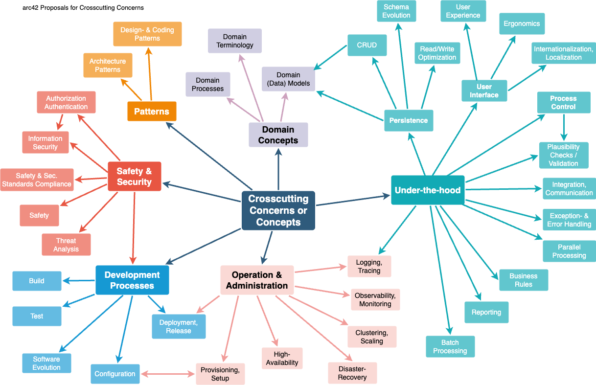

## Navigation
> * [Qualitätsziele](#qualitätsziele)
> * [Stakeholder](#stakeholder)
> * [Randbedingen](#randbedingungen)
> * [Bausteinsicht](#bausteinsicht)
> * [Laufzeitsicht](#laufzeitsicht)
> * [Verteilungssicht](#verteilungssicht)
> * [Querschnittliche Konzepte](#querschnittliche-konzepte)
> * [Architekturentscheidungen](#architekturentscheidungen)
> * [Qualitätsanforderungen](#qualitätsanforderungen)

# Einführung und Ziele

Beschreibt die wesentlichen Anforderungen und treibenden Kräfte, die bei
der Umsetzung der Softwarearchitektur und Entwicklung des Systems
berücksichtigt werden müssen.

Dazu gehören:

- zugrunde liegende Geschäftsziele,

- wesentliche Aufgabenstellungen,

- wesentliche funktionale Anforderungen,

- Qualitätsziele für die Architektur und

- relevante Stakeholder und deren Erwartungshaltung.

## Aufgabenstellung

**Inhalt**

Kurzbeschreibung der fachlichen Aufgabenstellung, treibenden Kräfte,
Extrakt (oder Abstract) der Anforderungen. Verweis auf (hoffentlich
vorliegende) Anforderungsdokumente (mit Versionsbezeichnungen und
Ablageorten).

**Motivation**

Aus Sicht der späteren Nutzung ist die Unterstützung einer fachlichen
Aufgabe oder Verbesserung der Qualität der eigentliche Beweggrund, ein
neues System zu schaffen oder ein bestehendes zu modifizieren.

**Form**

Kurze textuelle Beschreibung, eventuell in tabellarischer Use-Case Form.
Sofern vorhanden, sollte die Aufgabenstellung Verweise auf die
entsprechenden Anforderungsdokumente enthalten.

Halten Sie diese Auszüge so knapp wie möglich und wägen Sie Lesbarkeit
und Redundanzfreiheit gegeneinander ab.

# Qualitätsziele

Die folgenden Qualitätsziele fassen jene nicht-funktionalen Anforderungen zusammen, die aus architektonischer Sicht für FlatMate besonders relevant sind.  
Sie priorisieren die Qualitätsaspekte, die die wesentlichen Architekturentscheidungen des Systems beeinflussen.  
Die Ziele sind möglichst konkret formuliert und durch Szenarien operationalisiert, damit ihre Bedeutung für Entwurf, Implementierung und Bewertung der Architektur nachvollziehbar bleibt.

| Priorität | Qualitätsziel | Bedeutung für die Architektur | Konkretes Szenario / Operationalisierung |
|----------:|---------------|-------------------------------|------------------------------------------|
| 1 | Korrekte und schnelle Verarbeitung fachlicher Kernprozesse | Das System muss zentrale WG-Prozesse, insbesondere Budgetvorgänge, korrekt und ohne spürbare Verzögerung verarbeiten. Dies beeinflusst insbesondere Datenmodell, Transaktionslogik und Datenbankwahl. | Ein Bewohner speichert eine neue Ausgabe. Das System speichert die Transaktion korrekt, berechnet die Anteile bzw. Schulden neu und aktualisiert die Übersicht in unter 1–2 Sekunden. |
| 2 | Sicherheit und Schutz sensibler WG-Daten | Da FlatMate mit Accounts, Einladungslinks bzw. -codes, Rollen und personenbezogenen Daten arbeitet, muss die Architektur sichere Authentifizierung, geschützte Sessions und serverseitige Rechteprüfungen gewährleisten. | Ein Nutzer meldet sich an oder tritt einer WG per Invite bei. Die Session darf nicht clientseitig auslesbar sein, Rollen müssen serverseitig geprüft werden, und ungültige oder abgelaufene Einladungen dürfen keinen Zugriff erzeugen. |
| 3 | Hohe Usability und unmittelbares Feedback | Die Web-App richtet sich an Alltagsnutzer in einer WG. Viele Kerninteraktionen müssen ohne Reload, verständlich und unmittelbar wirken. Dies beeinflusst UI-Design, Validierungslogik und Reaktionsverhalten der Anwendung. | Bei fehlerhafter Registrierung erhält der Nutzer in unter 0,5 Sekunden eine klare Fehlermeldung, ohne dass Eingaben verloren gehen. Beim Hinzufügen eines Artikels in der Einkaufsliste ist der neue Eintrag in unter 0,5 Sekunden sichtbar. |
| 4 | Wartbarkeit und Erweiterbarkeit des Systems | FlatMate besitzt bereits viele geplante Funktionen über den MVP hinaus. Die Architektur muss deshalb neue Module integrierbar machen, ohne den bestehenden Kern stark zu beeinträchtigen. Dies beeinflusst insbesondere die Modularisierung und die Struktur der Codebasis. | Ein neues Feature soll in die Codebasis integriert werden können, ohne bestehende Module wesentlich umzubauen; Ziel ist eine Erweiterung mit minimalen Änderungen außerhalb des betroffenen Fachmoduls. |
| 5 | Verfügbarkeit und zuverlässiger Zugriff | Als Alltagswerkzeug für eine WG muss die Anwendung im normalen Betrieb erreichbar und stabil sein. Dieses Ziel beeinflusst Hosting, Error Handling, Betriebskonzept und Backup-Strategie. | Ein WG-Mitglied öffnet die Web-App. Frontend, Backend und Datenbank müssen im Normalbetrieb verfügbar sein; angestrebtes Ziel ist eine Verfügbarkeit von 99 %. |

# Stakeholder

Die nachfolgende Tabelle gibt einen Überblick über die wichtigsten Stakeholder von FlatMate.  
Sie zeigt, welche Personen, Rollen oder Nutzergruppen ein berechtigtes Interesse an der Architektur und ihrer Dokumentation haben und welche Erwartungen sie damit verbinden.  
Die Stakeholder dienen als Orientierung dafür, welche Aspekte der Architektur besonders verständlich, nachvollziehbar und dokumentiert sein müssen.

| Rolle / Stakeholder | Kontakt | Erwartungshaltung bezüglich Architektur und Dokumentation |
|---------------------|---------|-----------------------------------------------------------|
| Projektleitung / Product-Verantwortliche im Team | Leon | Erwartet eine nachvollziehbare, begründete Architektur, die im Projektkontext realistisch umsetzbar ist, das MVP unterstützt und im Bericht bzw. in Präsentationen sauber argumentiert werden kann. |
| Entwicklerteam | Denis, Yaroslav, Mykyta | Benötigt eine klar strukturierte, wartbare Architektur mit verständlicher Modulaufteilung, dokumentierten Entscheidungen und eindeutigen technischen Leitplanken, damit Features parallel entwickelt werden können. |
| Endnutzer: WG-Bewohner | spätere Nutzergruppe | Erwarten eine einfache Bedienung, transparente Verwaltung von Ausgaben, Aufgaben, Terminen und Einladungen sowie ein zuverlässiges und verständliches Verhalten der Anwendung. |
| WG-Admins / Organisatoren | spätere Nutzergruppe | Erwarten Rechteverwaltung, sichere Einladungsmechanismen, Kontrolle über Mitglieder und eine verlässliche Durchsetzung von Rollen und Berechtigungen. |
| Tester / Reviewende im Team | Denis, Yaroslav, Mykyta, Kim, Leon | Benötigen klare Anforderungen, nachvollziehbare Use Cases, konsistente Fehlerfälle und dokumentierte Qualitätsziele, damit Verhalten und Architektur überprüfbar sind. |

# Randbedingungen

Die folgenden Randbedingungen beschreiben wesentliche technische, organisatorische, fachliche und konventionelle Vorgaben, die den Entwurf und die Umsetzung der Architektur von FlatMate beeinflussen.  
Sie schränken den Lösungsraum bewusst ein und bilden damit einen verbindlichen Rahmen für Architektur- und Implementierungsentscheidungen.  
Die Berücksichtigung dieser Randbedingungen ist notwendig, um eine realistische und im Projektkontext tragfähige Architektur zu entwickeln.

| Kategorie | Randbedingung | Erläuterung |
|-----------|---------------|-------------|
| Technisch | Web-App als Zielplattform | FlatMate wird als browserbasierte Webanwendung entwickelt, nicht als native Mobile- oder Desktop-Anwendung. Dadurch ergeben sich Anforderungen an Responsive Design und Browser-Kompatibilität. |
| Technisch | Schlanker Monolith mit Next.js | Die Architektur ist nicht frei offen, sondern bereits auf einen modularen Monolithen mit Next.js festgelegt. Das schließt Microservices für den aktuellen Projektkontext explizit aus. |
| Technisch | TypeScript im Frontend | Die Frontend-Entwicklung soll in TypeScript erfolgen. Das beeinflusst Tooling, Build-Prozess und Codekonventionen. |
| Technisch | Browser-/Gerätesupport | Die Anwendung soll auf aktuellen Versionen von Chrome, Edge, Firefox, Safari sowie mobilen Browsern funktionieren. Daraus folgen Einschränkungen für UI- und API-Verhalten. |
| Organisatorisch | MVP-Fokus | Im Projektumfang stehen zunächst WG erstellen/beitreten, Ausgaben erfassen und aufteilen sowie Salden/Ausgleich im Vordergrund. Viele weitere Features sind bewusst nachrangig oder außerhalb des MVP. |
| Organisatorisch | Scrum-Setup mit Sprints und Teamarbeit | Der Entwicklungsprozess ist durch Sprintarbeit, Meetings und Aufgabenaufteilung geprägt. Die Architektur muss daher arbeitsteilige Entwicklung unterstützen. |
| Sicherheits-/fachlich | Minimierung personenbezogener Daten | Es sollen nur notwendige personenbezogene Daten wie Name, E-Mail und WG-Bezug verarbeitet werden. Das beeinflusst Datenmodell und Sicherheitsmaßnahmen. |
| Sicherheits-/fachlich | Kryptografisch sichere Invite-Codes | Einladungsmechanismen dürfen nicht trivial erratbar sein; daraus ergibt sich eine klare Vorgabe an Erzeugung und Verwaltung von Einladungen. |
| Konvention | Keine dotenv-Dateien im Repository | Konfigurationsdaten sollen nicht direkt im Repository abgelegt werden; stattdessen ist eine `.env.example` vorgesehen. Das beeinflusst Build, Setup und Dokumentation. |
| Konvention | Einheitliches Fehlerformat | API-Fehler sollen einer einheitlichen Struktur `{ code, message, details }` folgen. Das ist eine technische und dokumentarische Vorgabe für Backend und Schnittstellen. |

# Kontextabgrenzung

**Inhalt**

Die Kontextabgrenzung grenzt das System gegen alle Kommunikationspartner
(Nachbarsysteme und Benutzerrollen) ab. Sie legt damit die externen
Schnittstellen fest und zeigt damit auch die Verantwortlichkeit (scope)
Ihres Systems: Welche Verantwortung trägt das System und welche
Verantwortung übernehmen die Nachbarsysteme?

Differenzieren Sie fachlichen (Ein- und Ausgaben) und technischen
Kontext (Kanäle, Protokolle, Hardware), falls nötig.

**Motivation**

Die fachlichen und technischen Schnittstellen zur Kommunikation gehören
zu den kritischsten Aspekten eines Systems. Stellen Sie sicher, dass Sie
diese komplett verstanden haben.

**Form**

Verschiedene Optionen:

- Diverse Kontextdiagramme

- Listen von Kommunikationsbeziehungen mit deren Schnittstellen

**Weiterführende Informationen**

Siehe [Kontextabgrenzung](https://docs.arc42.org/section-3/) in der
online-Dokumentation (auf Englisch!).

## Fachlicher Kontext

**Inhalt**

Festlegung **aller** Kommunikationsbeziehungen (Nutzer, IT-Systeme, …​)
mit Erklärung der fachlichen Ein- und Ausgabedaten oder Schnittstellen.
Zusätzlich (bei Bedarf) fachliche Datenformate oder Protokolle der
Kommunikation mit den Nachbarsystemen.

**Motivation**

Alle Beteiligten müssen verstehen, welche fachlichen Informationen mit
der Umwelt ausgetauscht werden.

**Form**

Alle Diagrammarten, die das System als Blackbox darstellen und die
fachlichen Schnittstellen zu den Nachbarsystemen beschreiben.

Alternativ oder ergänzend können Sie eine Tabelle verwenden. Der Titel
gibt den Namen Ihres Systems wieder; die drei Spalten sind:
Kommunikationsbeziehung, Eingabe, Ausgabe.

**\<Diagramm und/oder Tabelle\>**

**\<optional: Erläuterung der externen fachlichen Schnittstellen\>**

## Technischer Kontext

**Inhalt**

Technische Schnittstellen (Kanäle, Übertragungsmedien) zwischen dem
System und seiner Umwelt. Zusätzlich eine Erklärung (*mapping*), welche
fachlichen Ein- und Ausgaben über welche technischen Kanäle fließen.

**Motivation**

Viele Stakeholder treffen Architekturentscheidungen auf Basis der
technischen Schnittstellen des Systems zu seinem Kontext.

Insbesondere bei der Entwicklung von Infrastruktur oder Hardware sind
diese technischen Schnittstellen durchaus entscheidend.

**Form**

Beispielsweise UML Deployment-Diagramme mit den Kanälen zu
Nachbarsystemen, begleitet von einer Tabelle, die Kanäle auf
Ein-/Ausgaben abbildet.

**\<Diagramm oder Tabelle\>**

**\<optional: Erläuterung der externen technischen Schnittstellen\>**

**\<Mapping fachliche auf technische Schnittstellen\>**

# Lösungsstrategie

**Inhalt**

Kurzer Überblick über die grundlegenden Entscheidungen und
Lösungsansätze, die Entwurf und Implementierung des Systems prägen.
Hierzu gehören:

- Technologieentscheidungen

- Entscheidungen über die Top-Level-Zerlegung des Systems,
  beispielsweise die Verwendung gesamthaft prägender Entwurfs- oder
  Architekturmuster,

- Entscheidungen zur Erreichung der wichtigsten Qualitätsanforderungen
  sowie

- relevante organisatorische Entscheidungen, beispielsweise für
  bestimmte Entwicklungsprozesse oder Delegation bestimmter Aufgaben an
  andere Stakeholder.

**Motivation**

Diese wichtigen Entscheidungen bilden wesentliche „Eckpfeiler“ der
Architektur. Von ihnen hängen viele weitere Entscheidungen oder
Implementierungsregeln ab.

**Form**

Fassen Sie die zentralen Entwurfsentscheidungen **kurz** zusammen.
Motivieren Sie, ausgehend von Aufgabenstellung, Qualitätszielen und
Randbedingungen, was Sie entschieden haben und warum Sie so entschieden
haben. Vermeiden Sie redundante Beschreibungen und verweisen Sie eher
auf weitere Ausführungen in Folgeabschnitten.

**Weiterführende Informationen**

Siehe [Lösungsstrategie](https://docs.arc42.org/section-4/) in der
online-Dokumentation (auf Englisch!).

# Bausteinsicht

**Inhalt**

Die Bausteinsicht zeigt die statische Zerlegung des Systems in Bausteine
(Module, Komponenten, Subsysteme, Klassen, Schnittstellen, Pakete,
Bibliotheken, Frameworks, Schichten, Partitionen, Tiers, Funktionen,
Makros, Operationen, Datenstrukturen, …​) sowie deren Abhängigkeiten
(Beziehungen, Assoziationen, …​)

> * [Ebene 1](#ebene-1)
> * [Ebene 2](#ebene-2)
> * [Ebene 3](#ebene-3)

**Motivation**

Die Anwendung besteht aus mehreren funktionalen und technischen Teilbereichen. Ohne geeignete Strukturierung würde der Quellcode schnell unübersichtlich werden. Die Bausteinsicht hilft dabei,
* die Zuständigkeiten der einzelnen Module zu verstehen,
* die Trennung zwischen UI, API, Geschäftslogik und Hilfsbausteinen nachvollziehbar zu machen,
* die Erweiterbarkeit und Wartbarkeit des Systems sicherzustellen.

**Form**

Die Bausteinsicht ist als hierarchische Sammlung von Whiteboxen
aufgebaut:

- **Ebene 1** beschreibt das Gesamtsystem.
- **Ebene 2** beschreibt den inneren Aufbau des Bausteins `app`.
- **Ebene 3** beschreibt den inneren Aufbau des Bausteins `app/api/wgs`.

## Ebene 1

### Übersichtsdiagramm

### Begründung

Auf oberster Ebene wird FlatMate in kleinere Bausteine zerlegt. Dadurch wird die grundlegende Architektur des Systems
sichtbar. Die Zerlegung orientiert sich an den wesentlichen Verantwortungsbereichen
des Projekts:

### Enthaltene Bausteine

| **Name** | **Verantwortung** |
|----------|-------------------|
| `app` | Enthält die sichtbaren Seiten der Anwendung, Layouts, WG-Bereiche sowie die serverseitigen API-Route-Handler |
| `components` | Beinhaltet wiederverwendbare UI-Komponenten und Icons |
| `lib` | Stellt technische Hilfsbausteine wie Authentifizierung, Zugriffsprüfung, Validierung und Infrastrukturzugriff bereit |
| `models` | Enthält fachliche Datenmodelle des Systems |
| `public` | Beinhaltet statische Dateien und Assets, die von der Präsentationsschicht genutzt werden |

### Wichtige Schnittstellen

Die wichtigste Abhängigkeitsrichtung auf dieser Ebene verläuft von
`app` zu den unterstützenden Bausteinen:

- `app` nutzt `components` für wiederverwendbare UI-Bausteine,
- `app` nutzt `lib` für Authentifizierung, Validierung und technische
  Hilfslogik,
- `app` nutzt `models` für fachliche Datenstrukturen,
- `app` nutzt `public` für statische Ressourcen.

## Ebene 2

### Whitebox `app`

Die zweite Ebene beschreibt den inneren Aufbau des Bausteins `app`, da
dieser den zentralen fachlichen und technischen Kern der Anwendung
enthält.

### Übersichtsdiagramm

### Begründung

Der Baustein `app` ist für FlatMate besonders relevant, da hier sowohl
die Benutzerinteraktion als auch die serverseitige Anwendungslogik
zusammenlaufen. Gleichzeitig ist `app` der Bereich mit den meisten
Unterstrukturen und damit architektonisch besonders wichtig.

### Enthaltene Bausteine

| **Name** | **Verantwortung** |
|----------|-------------------|
| Öffentliche Seiten | Einstieg in das System für nicht eingeloggte Nutzer, insbesondere Landing Page, Login, Registrierung, Invite-Einstieg und WG-Erstellung |
| Benutzerbereich | Darstellung der benutzerspezifischen Übersicht, insbesondere Profil und WG-Liste |
| WG-Bereich | Interner Bereich einer konkreten WG mit eigenem Layout, Dashboard und den Modulen Kosten, Putzplan und Einkaufsliste |
| API-Endpunkte | Serverseitige Route-Handler für Authentifizierung, WG-Verwaltung, Einladungen und weitere Fachfunktionen |
| Styles / Layouts | CSS-Dateien und Layout-Strukturen zur konsistenten Gestaltung der Anwendung |

### Wichtige Schnittstellen

Die wichtigsten Beziehungen innerhalb von `app` sind:

- Öffentliche Seiten, Benutzerbereich und WG-Bereich rufen die
  API-Endpunkte über HTTP auf.
- Die sichtbaren Bereiche verwenden gemeinsame Styles und Layouts.
- Im WG-Bereich sorgt ein gemeinsames Layout mit `AppShell` für eine
  einheitliche interne Navigation und Darstellung.

## Ebene 3

### Whitebox `app/api/wgs`

Die dritte Ebene beschreibt den inneren Aufbau des Bausteins
`app/api/wgs`, da dieser ein besonders relevanter Teil der Anwendung ist.  
Hier befinden sich zentrale Endpunkte für das Laden von WGs, das
Verlassen einer WG, das Erzeugen von Einladungen und die Verwaltung von
WG-Events.

### Übersichtsdiagramm

### Begründung

Der Baustein `app/api/wgs` wurde für Ebene 3 ausgewählt, weil er eine
hohe fachliche Bedeutung besitzt und mehrere sicherheits- und
zustandsrelevante Operationen bündelt.  
Insbesondere die Verarbeitung von WG-Zugriffen, Rollen, Leave-Logik,
Invite-Erzeugung und Event-Handling macht diesen Bereich architektonisch
wichtiger als einfache Standardbausteine.

### Enthaltene Bausteine

| **Name** | **Verantwortung** |
|----------|-------------------|
| WGs Collection | Lädt alle WGs des aktuell eingeloggten Benutzers |
| WG by ID | Lädt Details einer konkreten WG und verarbeitet Operationen auf WG-Ebene |
| Leave WG | Verarbeitet das Verlassen einer WG, einschließlich rollenbezogener Folgelogik |
| Invites | Erzeugt Einladungscodes bzw. Links für eine WG |
| Events | Lädt, erstellt und löscht Events innerhalb einer WG |
| Gemeinsame Infrastruktur | Stellt Session-Verwaltung, WG-Zugriffsprüfung, Validierung und Persistenzzugriff bereit |

### Wichtige Schnittstellen

Die Teilbausteine von `app/api/wgs` verwenden gemeinsame technische
Hilfsbausteine:

- **Session Management** zur Ermittlung des aktuell eingeloggten
  Benutzers,
- **WG Access Control** zur Prüfung von Mitgliedschaft und Rechten,
- **Validation** zur Prüfung von Eingabedaten,
- **Persistence Layer** für den Zugriff auf die Datenhaltung.

Diese Schnittstellen sind für das Verständnis der Sicherheits- und
Geschäftslogik in diesem Bereich zentral.

# Laufzeitsicht

**Inhalt**

Die Laufzeitsicht beschreibt das Verhalten von FlatMate zur Ausführungszeit.
Für FlatMate wurden insbesondere solche Szenarien ausgewählt, die

- zentrale Benutzerinteraktionen abbilden,
- sicherheitsrelevante Prüfungen enthalten,
- fachlich wichtige Kernprozesse beschreiben,
- sowie nicht triviale Sonderlogik sichtbar machen.

Die dargestellten Abläufe betreffen insbesondere 
> * [Registrierung](#registrierung)
> * [Login](#login)
> * [WG-Erstellung](#wg-anlegen)
> * [Invite-Erzeugung](#einladung-erzeugen)
> * [WG-Beitritt](#wg-beitreten)
> * [Verlassen einer WG](#wg-verlassen)

**Motivation**

Die Laufzeitsicht macht nachvollziehbar, wie die Bausteine des Systems zur Laufzeit zusammenarbeiten.  
Sie zeigt insbesondere,

- wie Benutzeraktionen durch Frontend und Backend verarbeitet werden,
- an welchen Stellen Validierung, Session-Prüfung und Autorisierung stattfinden,
- wie fachliche Regeln umgesetzt werden,
- und wie FlatMate auf Sonder- und Fehlerfälle reagiert.

**Form**

Die Abläufe werden durch Sequenzdiagramme auf Komponentenebene beschrieben.  
Ergänzend wird jeder Ablauf durch kurze textuelle Erläuterungen präzisiert.

## Registrierung

### Beschreibung

Dieses Szenario beschreibt die Registrierung eines neuen Benutzers

1. Der Benutzer öffnet die Registrierungsseite und gibt seine Daten ein.
2. Das Frontend sendet die Eingaben an den Registrierungs-Endpunkt.
3. Die Eingaben werden serverseitig validiert.
4. Bei ungültigen Eingaben werden strukturierte Fehlermeldungen
   zurückgegeben und im Formular angezeigt.
5. Bei gültigen Eingaben wird ein neuer Benutzer in der Datenhaltung
   angelegt.
6. Direkt im Anschluss wird serverseitig eine Session erzeugt und als
   Cookie gesetzt.
7. Das Frontend leitet den Benutzer danach in den Benutzerbereich oder
   zum ursprünglich angefragten Ziel weiter.

## Login

### Beschreibung

Dieses Szenario beschreibt die Anmeldung eines bestehenden Benutzers.

1. Der Benutzer öffnet die Login-Seite und gibt E-Mail und Passwort ein.
2. Das Frontend sendet die Login-Daten an den Login-Endpunkt.
3. Der Endpunkt lädt den Benutzer anhand der E-Mail-Adresse.
4. Anschließend wird das Passwort geprüft.
5. Bei fehlerhaften Zugangsdaten wird eine Fehlermeldung zurückgegeben.
6. Bei erfolgreicher Authentifizierung wird serverseitig eine Session
   erzeugt und als Cookie gesetzt.
7. Danach erfolgt die Weiterleitung in den Benutzerbereich oder auf ein
   per `next` übergebenes Ziel.

## WG anlegen

### Beschreibung

Dieses Szenario beschreibt das Anlegen einer neuen WG durch einen
eingeloggten Benutzer.

1. Der Benutzer öffnet die Seite zur Erstellung einer WG.
2. Das Frontend sendet den WG-Namen an den Endpunkt zur WG-Erstellung.
3. Der Endpunkt bestimmt zunächst über die Session den aktuellen
   Benutzer.
4. Anschließend werden die Eingaben validiert.
5. Bei ungültigen Eingaben werden Fehlermeldungen zurückgegeben.
6. Bei gültigen Eingaben wird die WG gespeichert.
7. Danach wird für den Ersteller automatisch eine Membership mit der
   Rolle `ADMIN` angelegt.
8. Die Oberfläche aktualisiert anschließend die Benutzerübersicht bzw.
   leitet in den WG-Bereich weiter.

## Einladung erzeugen

### Beschreibung

Dieses Szenario beschreibt das Erzeugen eines Invite-Links für eine
bestehende WG.

1. Ein Admin der WG löst im WG-Bereich die Erstellung eines Invite-Links aus.
2. Der Browser ruft den WG-spezifischen Invite-Endpunkt auf.
3. Der Endpunkt ermittelt den aktuellen Benutzer über die Session.
4. Danach wird geprüft, ob der Benutzer Mitglied der WG ist und über
   ausreichende Rechte verfügt.
5. Bei fehlender Berechtigung wird die Anfrage abgewiesen.
6. Bei erfolgreicher Prüfung wird ein neuer Invite-Code erzeugt und mit
   Metadaten wie Ablaufzeit oder Nutzungsgrenzen gespeichert.
7. Der fertige Invite-Link wird an das Frontend zurückgegeben und kann
   anschließend geteilt werden.

## WG beitreten

### Beschreibung

Dieses Szenario beschreibt den Beitritt eines Benutzers zu einer WG über
einen Einladungslink.

1. Ein Benutzer öffnet einen Invite-Link.
2. Die Invite-Seite prüft zunächst, ob bereits eine gültige Session
   existiert.
3. Ist der Benutzer nicht eingeloggt, wird er auf Login bzw.
   Registrierung vorbereitet und anschließend zurückgeführt.
4. Beim Klick auf „WG beitreten“ wird der Join-Endpunkt aufgerufen.
5. Dort wird erneut serverseitig geprüft, welcher Benutzer aktuell
   angemeldet ist.
6. Anschließend wird der Invite geladen und auf Gültigkeit, Ablauf und
   Nutzbarkeit geprüft.
7. Zusätzlich wird geprüft, ob der Benutzer bereits Mitglied der WG ist.
8. Ist alles gültig, wird eine neue Membership für die WG angelegt und
   die Invite-Nutzung aktualisiert.
9. Danach wird der Benutzer in den WG-Bereich weitergeleitet.

## WG verlassen

### Beschreibung

Dieses Szenario beschreibt das Verlassen einer WG durch ein Mitglied,
einschließlich der Sonderlogik für den Fall, dass der letzte Admin die
WG verlässt.

1. Der Benutzer löst im Frontend die Aktion „WG verlassen“ aus.
2. Der Leave-Endpunkt ermittelt zunächst den aktuellen Benutzer über die
   Session.
3. Danach wird geprüft, ob der Benutzer tatsächlich Mitglied der
   betreffenden WG ist.
4. Die aktuelle Membership-Situation der WG wird geladen.
5. Falls der Benutzer das letzte Mitglied ist, kann die WG vollständig
   entfernt werden.
6. Falls weitere Mitglieder existieren, aber kein weiterer Admin
   vorhanden ist, wird die Admin-Rolle automatisch auf das am längsten
   verbleibende Mitglied übertragen.
7. Anschließend wird die Membership des austretenden Benutzers entfernt.
8. Das Frontend entfernt die WG aus der Benutzerübersicht.

# Verteilungssicht

**Inhalt**

Die Verteilungssicht beschreibt:

1.  die technische Infrastruktur, auf der Ihr System ausgeführt wird,
    mit Infrastrukturelementen wie Standorten, Umgebungen, Rechnern,
    Prozessoren, Kanälen und Netztopologien sowie sonstigen
    Bestandteilen, und

2.  die Abbildung von (Software-)Bausteinen auf diese Infrastruktur.

Häufig laufen Systeme in unterschiedlichen Umgebungen, beispielsweise
Entwicklung-/Test- oder Produktionsumgebungen. In solchen Fällen sollten
Sie alle relevanten Umgebungen aufzeigen.

Nutzen Sie die Verteilungssicht insbesondere dann, wenn Ihre Software
auf mehr als einem Rechner, Prozessor, Server oder Container abläuft
oder Sie Ihre Hardware sogar selbst konstruieren.

Aus Softwaresicht genügt es, auf die Aspekte zu achten, die für die
Softwareverteilung relevant sind. Insbesondere bei der
Hardwareentwicklung kann es notwendig sein, die Infrastruktur mit
beliebigen Details zu beschreiben.

**Motivation**

Software läuft nicht ohne Infrastruktur. Diese zugrundeliegende
Infrastruktur beeinflusst Ihr System und/oder querschnittliche
Lösungskonzepte, daher müssen Sie diese Infrastruktur kennen.

**Form**

Das oberste Verteilungsdiagramm könnte bereits in Ihrem technischen
Kontext enthalten sein, mit Ihrer Infrastruktur als EINE Blackbox. Jetzt
zoomen Sie in diese Infrastruktur mit weiteren Verteilungsdiagrammen
hinein:

- Die UML stellt mit Verteilungsdiagrammen (Deployment diagrams) eine
  Diagrammart zur Verfügung, um diese Sicht auszudrücken. Nutzen Sie
  diese, evtl. auch geschachtelt, wenn Ihre Verteilungsstruktur es
  verlangt.

- Falls Ihre Infrastruktur-Stakeholder andere Diagrammarten bevorzugen,
  die beispielsweise Prozessoren und Kanäle zeigen, sind diese hier
  ebenfalls einsetzbar.

**Weiterführende Informationen**

Siehe [Verteilungssicht](https://docs.arc42.org/section-7/) in der
online-Dokumentation (auf Englisch!).

## Infrastruktur Ebene 1

An dieser Stelle beschreiben Sie (als Kombination von Diagrammen mit
Tabellen oder Texten):

- die Verteilung des Gesamtsystems auf mehrere Standorte, Umgebungen,
  Rechner, Prozessoren o. Ä., sowie die physischen Verbindungskanäle
  zwischen diesen,

- wichtige Begründungen für diese Verteilungsstruktur,

- Qualitäts- und/oder Leistungsmerkmale dieser Infrastruktur,

- Zuordnung von Softwareartefakten zu Bestandteilen der Infrastruktur

Für mehrere Umgebungen oder alternative Deployments kopieren Sie diesen
Teil von arc42 für alle wichtigen Umgebungen/Varianten.

***\<Übersichtsdiagramm\>***

Begründung  
*\<Erläuternder Text\>*

Qualitäts- und/oder Leistungsmerkmale  
*\<Erläuternder Text\>*

Zuordnung von Bausteinen zu Infrastruktur  
*\<Beschreibung der Zuordnung\>*

## Infrastruktur Ebene 2

An dieser Stelle können Sie den inneren Aufbau (einiger)
Infrastrukturelemente aus Ebene 1 beschreiben.

Für jedes Infrastrukturelement kopieren Sie die Struktur aus Ebene 1.

### *\<Infrastrukturelement 1\>*

*\<Diagramm + Erläuterungen\>*

### *\<Infrastrukturelement 2\>*

*\<Diagramm + Erläuterungen\>*

…​

### *\<Infrastrukturelement n\>*

*\<Diagramm + Erläuterungen\>*

# Querschnittliche Konzepte

**Inhalt**

Dieser Abschnitt beschreibt übergreifende, prinzipielle Regelungen und
Lösungsansätze, die an mehreren Stellen (=*querschnittlich*) relevant
sind.

Solche Konzepte betreffen oft mehrere Bausteine. Dazu können vielerlei
Themen gehören, wie beispielsweise die Themen aus dem nachfolgenden
Diagramm:

<figure>

</figure>

**Motivation**

Konzepte bilden die Grundlage für *konzeptionelle Integrität*
(Konsistenz, Homogenität) der Architektur und damit eine wesentliche
Grundlage für die innere Qualität Ihrer Systeme.

Dieser Abschnitt im Template ist der richtige Ort für die konsistente
Behandlung solcher Themen.

Viele solche Konzepte beeinflussen oder beziehen sich auf mehrerer Ihrer
Bausteine.

**Form**

Kann vielfältig sein:

- Konzeptpapiere mit beliebiger Gliederung,

- beispielhafte Implementierung speziell für technische Konzepte,

- übergreifende Modelle/Szenarien mit Notationen, die Sie auch in den
  Architektursichten nutzen,

**Struktur**

Wählen Sie **nur** die wichtigsten Themen für Ihr System und erklären
das jeweilige Konzept dann unter einer Level-2 Überschrift dieser
Sektion (z.B. 8.1, 8.2 etc).

Beschränken Sie sich auf die wichtigen, und versuchen **auf keinen
Fall** alle oben dargestellten Themen zu bearbeiten.

**Weiterführende Informationen**

Einige Themen innerhalb von Systemen betreffen oft mehrere Bausteine,
Hardwareelemente oder Prozesse. Es könnte einfacher sein, solche
*Querschnittsthemen* an einer zentralen Stelle zu kommunizieren oder zu
dokumentieren, anstatt sie in der Beschreibung der betreffenden
Bausteine, Hardwareelemente oder Entwicklungsprozesse zu wiederholen.

Bestimmte Konzepte können **alle** Elemente eines Systems betreffen,
andere sind vielleicht nur für einige wenige relevant.

Siehe [Querschnittliche Konzepte](https://docs.arc42.org/section-8/) in
der online-Dokumentation (auf Englisch).

## *\<Konzept 1\>*

*\<Erklärung\>*

## *\<Konzept 2\>*

*\<Erklärung\>*

…​

## *\<Konzept n\>*

*\<Erklärung\>*

# Architekturentscheidungen

**Inhalt**

Wichtige, teure, große oder riskante Architektur- oder
Entwurfsentscheidungen inklusive der jeweiligen Begründungen. Mit
"Entscheidungen" meinen wir hier die Auswahl einer von mehreren
Alternativen unter vorgegebenen Kriterien.

Wägen Sie ab, inwiefern Sie Entscheidungen hier zentral beschreiben,
oder wo eine lokale Beschreibung (z.B. in der Whitebox-Sicht von
Bausteinen) sinnvoller ist. Vermeiden Sie Redundanz. Verweisen Sie evtl.
auf Abschnitt 4, wo schon grundlegende strategische Entscheidungen
beschrieben wurden.

**Motivation**

Stakeholder des Systems sollten wichtige Entscheidungen verstehen und
nachvollziehen können.

**Form**

Verschiedene Möglichkeiten:

- ADR ([Documenting Architecture
  Decisions](https://cognitect.com/blog/2011/11/15/documenting-architecture-decisions))
  für jede wichtige Entscheidung

- Liste oder Tabelle, nach Wichtigkeit und Tragweite der Entscheidungen
  geordnet

- ausführlicher in Form einzelner Unterkapitel je Entscheidung

**Weiterführende Informationen**

Siehe [Architekturentscheidungen](https://docs.arc42.org/section-9/) in
der arc42 Dokumentation (auf Englisch!). Dort finden Sie Links und
Beispiele zum Thema ADR.

# Qualitätsanforderungen

**Inhalt**

Dieser Abschnitt enthält alle relevanten Qualitätsanforderungen.

Die wichtigsten davon haben Sie bereits in Abschnitt 1.2
(Qualitätsziele) hervorgehoben, daher soll hier nur auf sie verwiesen
werden. In diesem Abschnitt 10 sollten Sie auch Qualitätsanforderungen
mit geringerer Bedeutung erfassen, deren Nichterfüllung keine großen
Risiken birgt (die aber *nice-to-have* sein könnten).

**Motivation**

Weil Qualitätsanforderungen die Architekturentscheidungen oft maßgeblich
beeinflussen, sollten Sie die für Ihre Stakeholder relevanten
Qualitätsanforderungen kennen, möglichst konkret und operationalisiert.

- Siehe [Qualitätsanforderungen](https://docs.arc42.org/section-10/) in
  der online-Dokumentation (auf Englisch!).

- Siehe auch das ausführliche [Q42 Qualitätsmodell auf
  https://quality.arc42.org](https://quality.arc42.org).

## Übersicht der Qualitätsanforderungen

**Inhalt**

Eine Übersicht oder Zusammenfassung der Qualitätsanforderungen.

**Motivation**

Oft stößt man auf Dutzende (oder sogar Hunderte) von detaillierten
Qualitätsanforderungen für ein System. In diesem Abschnitt sollten Sie
versuchen, sie zusammenzufassen, z. B. durch die Beschreibung von
Kategorien oder Themen (wie z.B. von [ISO
25010:2023](https://www.iso.org/obp/ui/#iso:std:iso-iec:25010:ed-2:v1:en)
oder [Q42](https://quality.arc42.org) vorgeschlagen).

Wenn diese Kurzbeschreibungen oder Zusammenfassungen bereits präzise,
spezifisch und messbar sind, können Sie Abschnitt 10.2 auslassen.

**Form**

Verwenden Sie eine einfache Tabelle, in der jede Zeile eine Kategorie
oder ein Thema und eine kurze Beschreibung der Qualitätsanforderung
enthält. Alternativ können Sie auch eine Mindmap verwenden, um diese
Qualitätsanforderungen zu strukturieren. In der Literatur (insb.
\[Bass+21\]) ist die Idee eines *Quality Attribute Utility Tree* (auf
Deutsch manchmal kurz als *Qualitätsbaum* bezeichnet) beschrieben
worden, der den Oberbegriff „Qualität“ als Wurzel hat und eine
baumartige Verfeinerung des Begriffs „Qualität“ verwendet.

## Qualitätsszenarien

**Inhalt**

Qualitätsszenarien konkretisieren Qualitätsanforderungen und ermöglichen
es zu entscheiden, ob sie erfüllt sind (im Sinne von
Akzeptanzkriterien). Stellen Sie sicher, dass Ihre Szenarien spezifisch
und messbar sind.

Zwei Arten von Szenarien finden wir besonders nützlich:

- Nutzungsszenarien (auch bekannt als Anwendungs- oder
  Anwendungsfallszenarien) beschreiben, wie das System zur Laufzeit auf
  einen bestimmten Auslöser reagieren soll. Hierunter fallen auch
  Szenarien zur Beschreibung von Effizienz oder Performance. Beispiel:
  Das System beantwortet eine Benutzeranfrage innerhalb einer Sekunde.

- Änderungsszenarien\_ beschreiben die gewünschte Wirkung einer Änderung
  oder Erweiterung des Systems oder seiner unmittelbaren Umgebung.
  Beispiel: Zusätzliche Funktionalität wird implementiert oder
  Anforderungen an ein Qualitätsmerkmal ändern sich, und der Aufwand
  oder die Dauer der Änderung wird gemessen.

**Form**

Typische Informationen für detaillierte Szenarien sind die folgenden:

In Kurzform (bevorzugt im Q42-Modell):

- K**ontext/Hintergrund**: Um welche Art von System oder Komponente
  handelt es sich, wie sieht die Umgebung oder Situation aus?

- **Quelle/Stimulus**: Wer oder was initiiert oder löst ein Verhalten,
  eine Reaktion oder eine Aktion aus.

- **Metrik/Akzeptanzkriterien**: Eine Reaktion einschließlich einer
  *Maßnahme* oder *Metrik*

Die Langform von Szenarien (die von der SEI und \[Bass+21\] bevorzugt
wird) ist detaillierter und enthält die folgenden Informationen:

- **Szenario-ID**: Ein eindeutiger Bezeichner für das Szenario.

- **Szenario-Name**: Ein kurzer, beschreibender Name für das Szenario.

- **Quelle**: Die Entität (Benutzer, System oder Ereignis), die das
  Szenario auslöst.

- **Stimulus**: Das auslösende Ereignis oder die Bedingung, auf die das
  System reagieren muss.

- **Umgebung**: Der betriebliche Kontext oder die Bedingungen, unter
  denen das System den Stimulus erlebt.

- **Artefakt**: Die Bausteine oder anderen Elemente des Systems, die von
  dem Stimulus betroffen sind.

- **Reaktion**: Das Ergebnis oder Verhalten, das das System als Reaktion
  auf den Stimulus zeigt.

- **Antwortmaß**: Das Kriterium oder die Metrik, nach der die Antwort
  des Systems bewertet wird.

**Beispiele**

Ausführliche Beispiele für Qualitätsanforderungen finden Sie auf [der
Website zum Qualitätsmodell Q42](https://quality.arc42.org).

- Len Bass, Paul Clements, Rick Kazman: „Software Architecture in
  Practice“, 4. Auflage, Addison-Wesley, 2021.

# Risiken und technische Schulden

**Inhalt**

Eine nach Prioritäten geordnete Liste der erkannten Architekturrisiken
und/oder technischen Schulden.

> Risikomanagement ist Projektmanagement für Erwachsene.
>
> —  Tim Lister Atlantic Systems Guild

Unter diesem Motto sollten Sie Architekturrisiken und/oder technische
Schulden gezielt ermitteln, bewerten und Ihren Management-Stakeholdern
(z.B. Projektleitung, Product-Owner) transparent machen.

**Form**

Liste oder Tabelle von Risiken und/oder technischen Schulden, eventuell
mit vorgeschlagenen Maßnahmen zur Risikovermeidung, Risikominimierung
oder dem Abbau der technischen Schulden.

**Weiterführende Informationen**

Siehe [Risiken und technische
Schulden](https://docs.arc42.org/section-11/) in der
online-Dokumentation (auf Englisch!).

# Glossar

**Inhalt**

Die wesentlichen fachlichen und technischen Begriffe, die Stakeholder im
Zusammenhang mit dem System verwenden.

Nutzen Sie das Glossar ebenfalls als Übersetzungsreferenz, falls Sie in
mehrsprachigen Teams arbeiten.

**Motivation**

Sie sollten relevante Begriffe klar definieren, so dass alle Beteiligten

- diese Begriffe identisch verstehen, und

- vermeiden, mehrere Begriffe für die gleiche Sache zu haben.

**Form**

Zweispaltige Tabelle mit \<Begriff\> und \<Definition\>.

Eventuell weitere Spalten mit Übersetzungen, falls notwendig.

**Weiterführende Informationen**

Siehe [Glossar](https://docs.arc42.org/section-12/) in der
online-Dokumentation (auf Englisch!).

| Begriff         | Definition         |
|-----------------|--------------------|
| *\<Begriff-1\>* | *\<Definition-1\>* |
| *\<Begriff-2*   | *\<Definition-2\>* |
