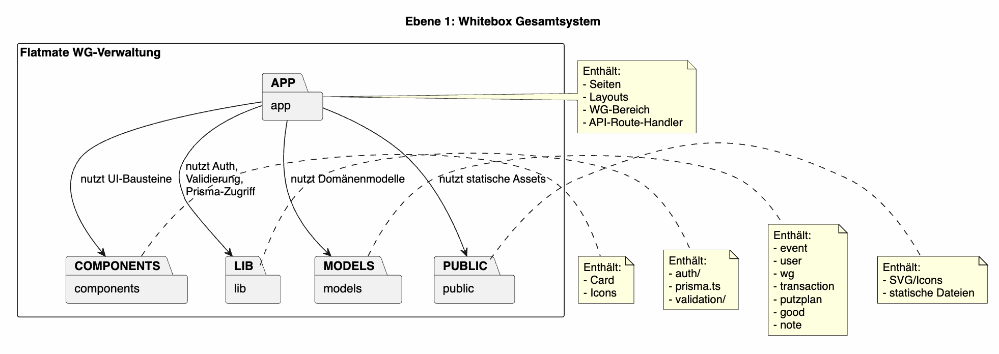
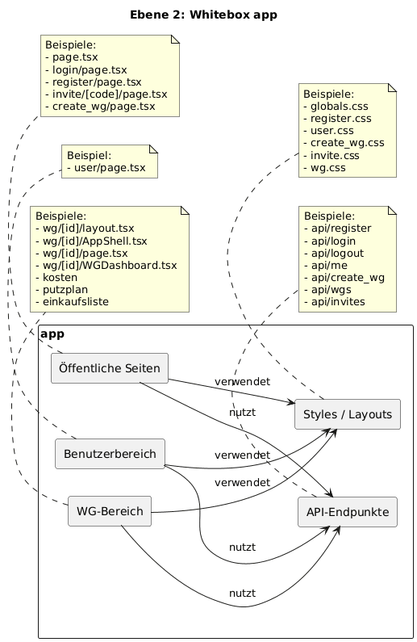
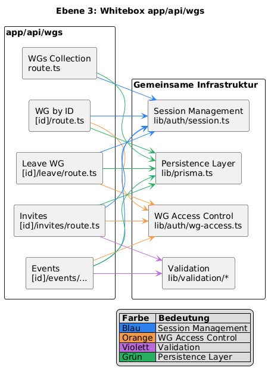
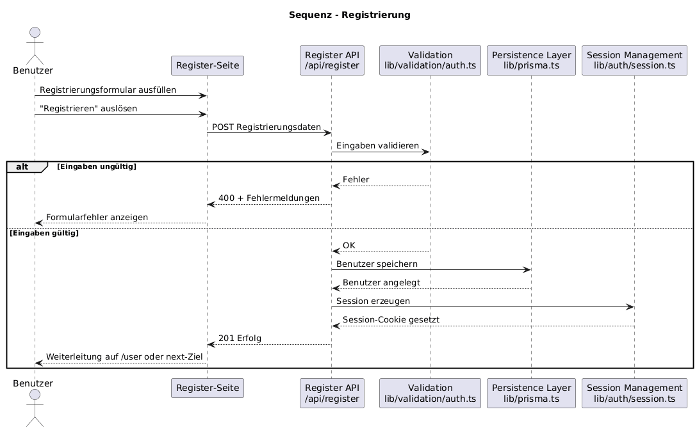
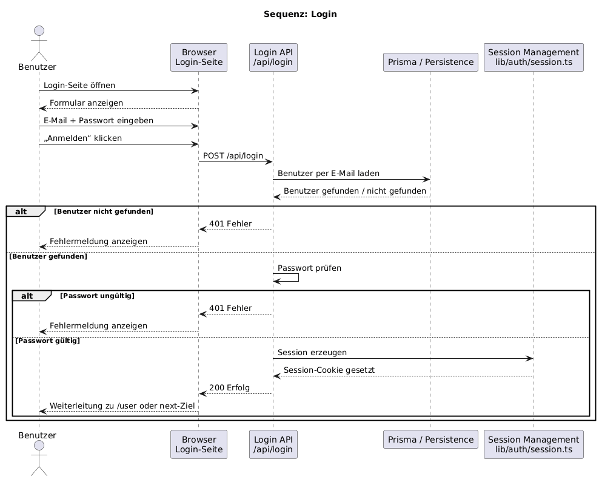
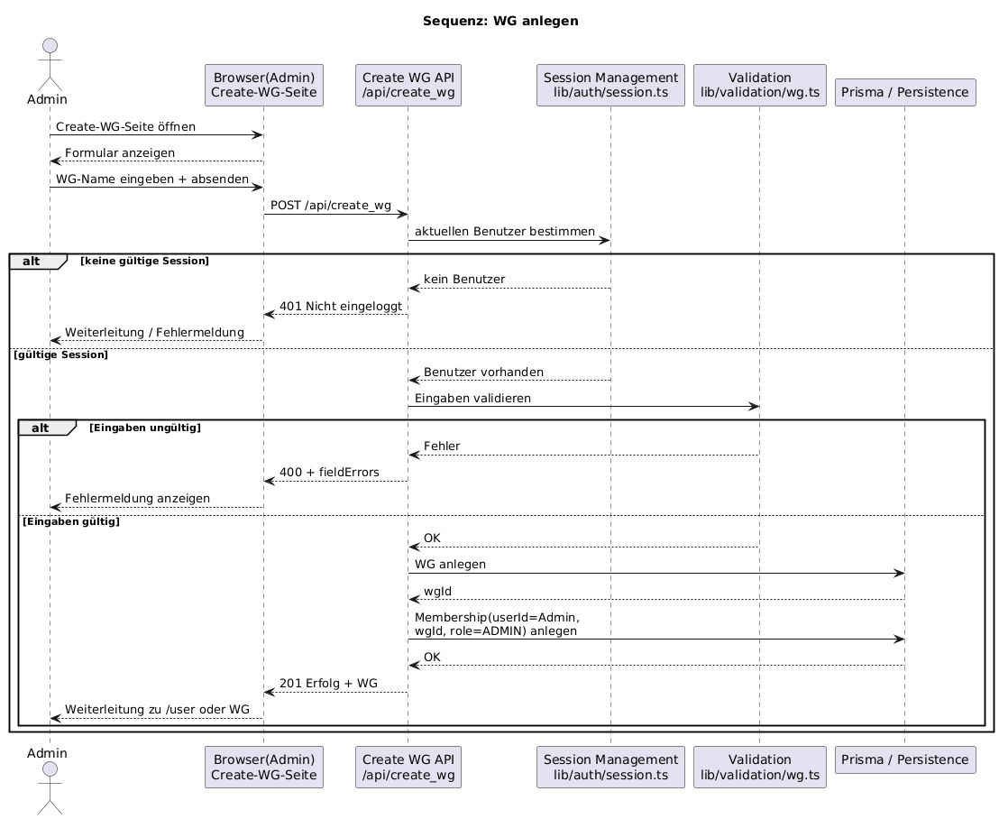
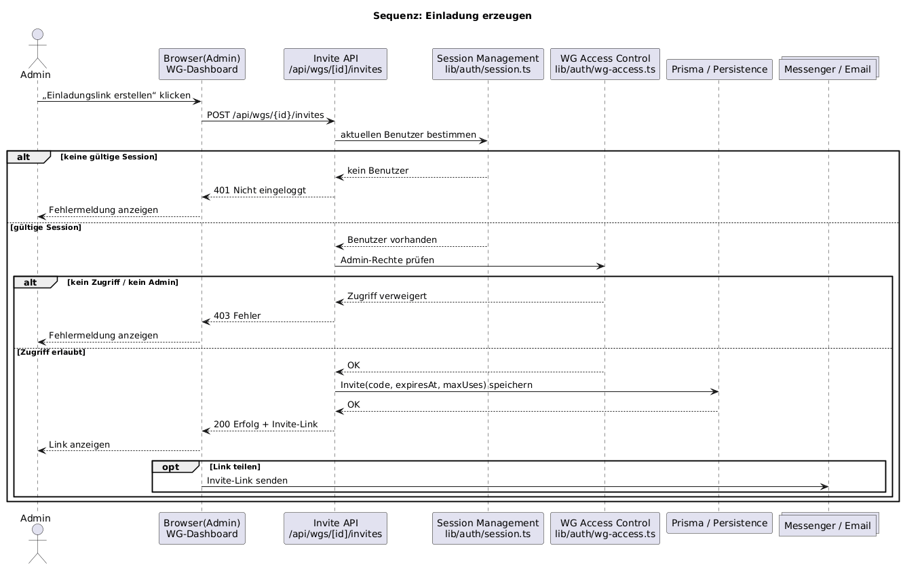
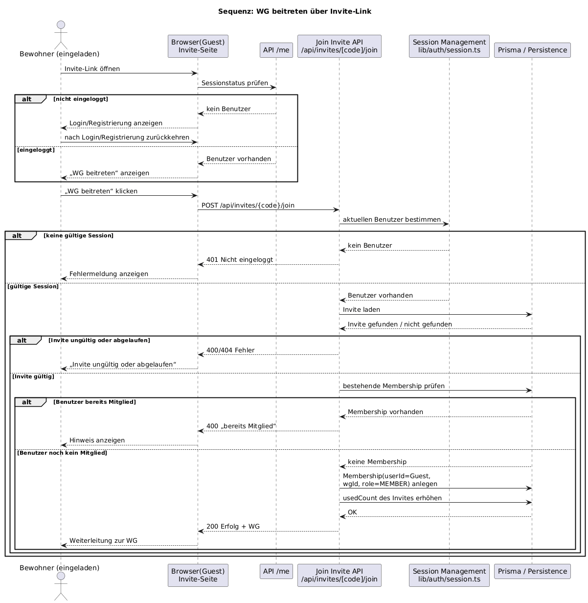
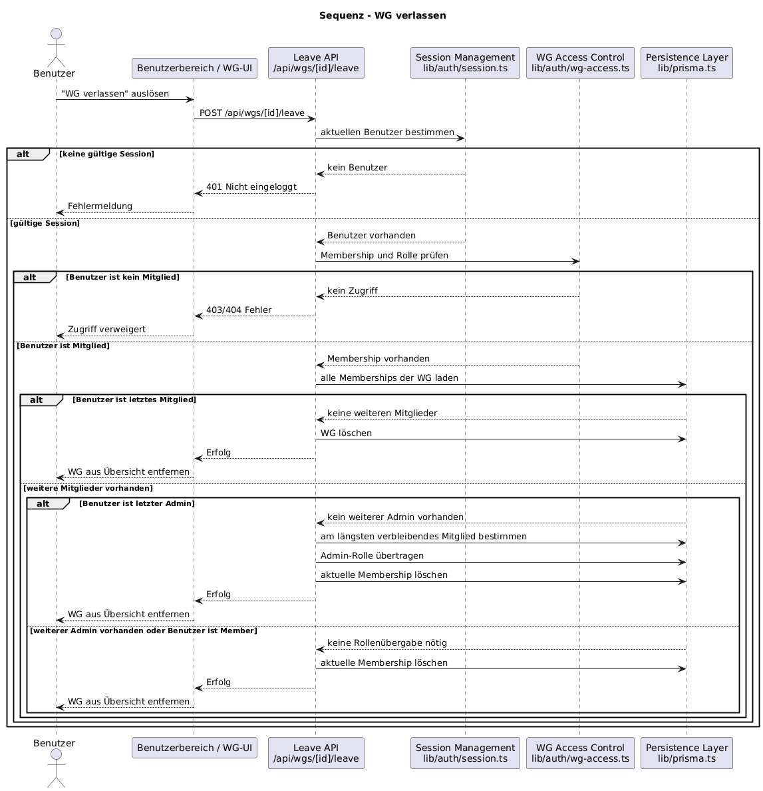

## Navigation
> * [Qualitätsziele](#qualitätsziele)
> * [Stakeholder](#stakeholder)
> * [Randbedingen](#randbedingungen)
> * [Kontextabgrenzung](#kontextabgrenzung)
> * [Lösungsstrategie](#lösungsstrategie)
> * [Bausteinsicht](#bausteinsicht)
> * [Laufzeitsicht](#laufzeitsicht)
> * [Verteilungssicht](#verteilungssicht)
> * [Querschnittliche Konzepte](#querschnittliche-konzepte)
> * [Architekturentscheidungen](#architekturentscheidungen)
> * [Qualitätsanforderungen](#qualitätsanforderungen)
> * [Risiken und technische Schulden](#risiken-und-technische-schulden)
> * [Glossar](#glossar)


# Einführung und Ziele

Beschreibt die wesentlichen Anforderungen und treibenden Kräfte, die bei
der Umsetzung der Softwarearchitektur und Entwicklung des Systems
berücksichtigt werden müssen.

Dazu gehören:

- zugrunde liegende Geschäftsziele,

- wesentliche Aufgabenstellungen,

- wesentliche funktionale Anforderungen,

- Qualitätsziele für die Architektur und

- relevante Stakeholder und deren Erwartungshaltung.

## Aufgabenstellung

<div class="formalpara-title">

**Inhalt**

</div>

Kurzbeschreibung der fachlichen Aufgabenstellung, treibenden Kräfte,
Extrakt (oder Abstract) der Anforderungen. Verweis auf (hoffentlich
vorliegende) Anforderungsdokumente (mit Versionsbezeichnungen und
Ablageorten).

<div class="formalpara-title">

**Motivation**

</div>

Aus Sicht der späteren Nutzung ist die Unterstützung einer fachlichen
Aufgabe oder Verbesserung der Qualität der eigentliche Beweggrund, ein
neues System zu schaffen oder ein bestehendes zu modifizieren.

<div class="formalpara-title">

**Form**

</div>

Kurze textuelle Beschreibung, eventuell in tabellarischer Use-Case Form.
Sofern vorhanden, sollte die Aufgabenstellung Verweise auf die
entsprechenden Anforderungsdokumente enthalten.

Halten Sie diese Auszüge so knapp wie möglich und wägen Sie Lesbarkeit
und Redundanzfreiheit gegeneinander ab.


# Qualitätsziele

Die folgenden Qualitätsziele fassen jene nicht-funktionalen Anforderungen zusammen, die aus architektonischer Sicht für FlatMate besonders relevant sind.  
Sie priorisieren die Qualitätsaspekte, die die wesentlichen Architekturentscheidungen des Systems beeinflussen.  
Die Ziele sind möglichst konkret formuliert und durch Szenarien operationalisiert, damit ihre Bedeutung für Entwurf, Implementierung und Bewertung der Architektur nachvollziehbar bleibt.

| Priorität | Qualitätsziel | Bedeutung für die Architektur | Konkretes Szenario / Operationalisierung |
|----------:|---------------|-------------------------------|------------------------------------------|
| 1 | Korrekte und schnelle Verarbeitung fachlicher Kernprozesse | Das System muss zentrale WG-Prozesse, insbesondere Budgetvorgänge, korrekt und ohne spürbare Verzögerung verarbeiten. Dies beeinflusst insbesondere Datenmodell, Transaktionslogik und Datenbankwahl. | Ein Bewohner speichert eine neue Ausgabe. Das System speichert die Transaktion korrekt, berechnet die Anteile bzw. Schulden neu und aktualisiert die Übersicht in unter 1–2 Sekunden. |
| 2 | Sicherheit und Schutz sensibler WG-Daten | Da FlatMate mit Accounts, Einladungslinks bzw. -codes, Rollen und personenbezogenen Daten arbeitet, muss die Architektur sichere Authentifizierung, geschützte Sessions und serverseitige Rechteprüfungen gewährleisten. | Ein Nutzer meldet sich an oder tritt einer WG per Invite bei. Die Session darf nicht clientseitig auslesbar sein, Rollen müssen serverseitig geprüft werden, und ungültige oder abgelaufene Einladungen dürfen keinen Zugriff erzeugen. |
| 3 | Hohe Usability und unmittelbares Feedback | Die Web-App richtet sich an Alltagsnutzer in einer WG. Viele Kerninteraktionen müssen ohne Reload, verständlich und unmittelbar wirken. Dies beeinflusst UI-Design, Validierungslogik und Reaktionsverhalten der Anwendung. | Bei fehlerhafter Registrierung erhält der Nutzer in unter 0,5 Sekunden eine klare Fehlermeldung, ohne dass Eingaben verloren gehen. Beim Hinzufügen eines Artikels in der Einkaufsliste ist der neue Eintrag in unter 0,5 Sekunden sichtbar. |
| 4 | Wartbarkeit und Erweiterbarkeit des Systems | FlatMate besitzt bereits viele geplante Funktionen über den MVP hinaus. Die Architektur muss deshalb neue Module integrierbar machen, ohne den bestehenden Kern stark zu beeinträchtigen. Dies beeinflusst insbesondere die Modularisierung und die Struktur der Codebasis. | Ein neues Feature soll in die Codebasis integriert werden können, ohne bestehende Module wesentlich umzubauen; Ziel ist eine Erweiterung mit minimalen Änderungen außerhalb des betroffenen Fachmoduls. |
| 5 | Verfügbarkeit und zuverlässiger Zugriff | Als Alltagswerkzeug für eine WG muss die Anwendung im normalen Betrieb erreichbar und stabil sein. Dieses Ziel beeinflusst Hosting, Error Handling, Betriebskonzept und Backup-Strategie. | Ein WG-Mitglied öffnet die Web-App. Frontend, Backend und Datenbank müssen im Normalbetrieb verfügbar sein; angestrebtes Ziel ist eine Verfügbarkeit von 99 %. |

# Stakeholder

Die nachfolgende Tabelle gibt einen Überblick über die wichtigsten Stakeholder von FlatMate.  
Sie zeigt, welche Personen, Rollen oder Nutzergruppen ein berechtigtes Interesse an der Architektur und ihrer Dokumentation haben und welche Erwartungen sie damit verbinden.  
Die Stakeholder dienen als Orientierung dafür, welche Aspekte der Architektur besonders verständlich, nachvollziehbar und dokumentiert sein müssen.

| Rolle / Stakeholder | Kontakt | Erwartungshaltung bezüglich Architektur und Dokumentation |
|---------------------|---------|-----------------------------------------------------------|
| Projektleitung / Product-Verantwortliche im Team | Leon | Erwartet eine nachvollziehbare, begründete Architektur, die im Projektkontext realistisch umsetzbar ist, das MVP unterstützt und im Bericht bzw. in Präsentationen sauber argumentiert werden kann. |
| Entwicklerteam | Denis, Yaroslav, Mykyta | Benötigt eine klar strukturierte, wartbare Architektur mit verständlicher Modulaufteilung, dokumentierten Entscheidungen und eindeutigen technischen Leitplanken, damit Features parallel entwickelt werden können. |
| Endnutzer: WG-Bewohner | spätere Nutzergruppe | Erwarten eine einfache Bedienung, transparente Verwaltung von Ausgaben, Aufgaben, Terminen und Einladungen sowie ein zuverlässiges und verständliches Verhalten der Anwendung. |
| WG-Admins / Organisatoren | spätere Nutzergruppe | Erwarten Rechteverwaltung, sichere Einladungsmechanismen, Kontrolle über Mitglieder und eine verlässliche Durchsetzung von Rollen und Berechtigungen. |
| Tester / Reviewende im Team | Denis, Yaroslav, Mykyta, Kim, Leon | Benötigen klare Anforderungen, nachvollziehbare Use Cases, konsistente Fehlerfälle und dokumentierte Qualitätsziele, damit Verhalten und Architektur überprüfbar sind. |

# Randbedingungen

Die folgenden Randbedingungen beschreiben wesentliche technische, organisatorische, fachliche und konventionelle Vorgaben, die den Entwurf und die Umsetzung der Architektur von FlatMate beeinflussen.  
Sie schränken den Lösungsraum bewusst ein und bilden damit einen verbindlichen Rahmen für Architektur- und Implementierungsentscheidungen.  
Die Berücksichtigung dieser Randbedingungen ist notwendig, um eine realistische und im Projektkontext tragfähige Architektur zu entwickeln.

| Kategorie | Randbedingung | Erläuterung |
|-----------|---------------|-------------|
| Technisch | Web-App als Zielplattform | FlatMate wird als browserbasierte Webanwendung entwickelt, nicht als native Mobile- oder Desktop-Anwendung. Dadurch ergeben sich Anforderungen an Responsive Design und Browser-Kompatibilität. |
| Technisch | Schlanker Monolith mit Next.js | Die Architektur ist nicht frei offen, sondern bereits auf einen modularen Monolithen mit Next.js festgelegt. Das schließt Microservices für den aktuellen Projektkontext explizit aus. |
| Technisch | TypeScript im Frontend | Die Frontend-Entwicklung soll in TypeScript erfolgen. Das beeinflusst Tooling, Build-Prozess und Codekonventionen. |
| Technisch | Browser-/Gerätesupport | Die Anwendung soll auf aktuellen Versionen von Chrome, Edge, Firefox, Safari sowie mobilen Browsern funktionieren. Daraus folgen Einschränkungen für UI- und API-Verhalten. |
| Organisatorisch | MVP-Fokus | Im Projektumfang stehen zunächst WG erstellen/beitreten, Ausgaben erfassen und aufteilen sowie Salden/Ausgleich im Vordergrund. Viele weitere Features sind bewusst nachrangig oder außerhalb des MVP. |
| Organisatorisch | Scrum-Setup mit Sprints und Teamarbeit | Der Entwicklungsprozess ist durch Sprintarbeit, Meetings und Aufgabenaufteilung geprägt. Die Architektur muss daher arbeitsteilige Entwicklung unterstützen. |
| Sicherheits-/fachlich | Minimierung personenbezogener Daten | Es sollen nur notwendige personenbezogene Daten wie Name, E-Mail und WG-Bezug verarbeitet werden. Das beeinflusst Datenmodell und Sicherheitsmaßnahmen. |
| Sicherheits-/fachlich | Kryptografisch sichere Invite-Codes | Einladungsmechanismen dürfen nicht trivial erratbar sein; daraus ergibt sich eine klare Vorgabe an Erzeugung und Verwaltung von Einladungen. |
| Konvention | Keine dotenv-Dateien im Repository | Konfigurationsdaten sollen nicht direkt im Repository abgelegt werden; stattdessen ist eine `.env.example` vorgesehen. Das beeinflusst Build, Setup und Dokumentation. |
| Konvention | Einheitliches Fehlerformat | API-Fehler sollen einer einheitlichen Struktur `{ code, message, details }` folgen. Das ist eine technische und dokumentarische Vorgabe für Backend und Schnittstellen. |


# Kontextabgrenzung
Die Kontextabgrenzung beschreibt FlatMate als Webanwendung zur Unterstützung der Organisation einer Wohngemeinschaft. Das System wird von WG-Mitgliedern über einen Web-Browser verwendet und verwaltet zentrale WG-Daten wie Mitglieder, Termine, Einkaufsliste, Ausgaben und Putzplan.

FlatMate ist dabei für die Bereitstellung der Benutzeroberfläche, die Verarbeitung der fachlichen Anwendungslogik und die Speicherung der Daten verantwortlich. Externe Drittsysteme sind im aktuellen Stand nicht produktiv angebunden. Eine mögliche Spotify-Integration ist als zukünftige Erweiterung vorgesehen, gehört jedoch nicht zum Kernumfang des aktuellen Systems.

## Fachlicher Kontext

FlatMate kommuniziert fachlich hauptsächlich mit den Nutzern der Anwendung. Die Nutzer geben WG-bezogene Informationen ein und erhalten daraus strukturierte Ansichten, Statusinformationen und Auswertungen innerhalb der Anwendung.

| Kommunikationsbeziehung | Eingabe an FlatMate | Ausgabe von FlatMate |
|---|---|---|
| WG-Mitglied / Nutzer | Registrierung, Login-Daten, WG-Daten, Einladungen, Termine, Einkaufseinträge, Ausgaben, Putzplan-Daten | Benutzeroberfläche, WG-Übersichten, Einkaufsliste, Budgetübersicht, Putzplan, Fehlermeldungen und Bestätigungen |
| FlatMate-Datenhaltung | Zu speichernde Anwendungsdaten, z. B. User, WG, Memberships, Events, Expenses, ShoppingListItems, CleaningRooms | Persistierte und wieder abrufbare WG-Daten |
| Spotify API, geplant | Anfrage nach Musik- oder Playlist-Funktionen | Musikbezogene Daten oder Playlist-Informationen, zukünftig vorgesehen |

### Erläuterung

Die wichtigste fachliche Schnittstelle besteht zwischen den WG-Mitgliedern und FlatMate. Nutzer können innerhalb der Anwendung ihre WG verwalten, gemeinsame Aufgaben koordinieren und WG-relevante Daten erfassen. FlatMate verarbeitet diese Eingaben, speichert sie dauerhaft und stellt sie anderen berechtigten WG-Mitgliedern wieder zur Verfügung.

Die Datenbank ist fachlich kein eigenständiger Akteur, sondern dient als persistente Datenhaltung des Systems. Sie speichert die von FlatMate verwalteten Informationen, beispielsweise Benutzer, WGs, Mitgliedschaften, Termine, Ausgaben, Einkaufslisten und Putzplan-Daten.

Die Spotify-Integration ist nur als geplante Erweiterung zu verstehen. Da sie im aktuellen System nicht zentral für die Kernfunktionen ist, wird sie nicht als produktive fachliche Schnittstelle betrachtet.

---

## Technischer Kontext

Technisch wird FlatMate als Webanwendung über einen Browser verwendet. Die Kommunikation zwischen Browser und Anwendung erfolgt über HTTP. Innerhalb der Anwendung werden API-Routen verwendet, um Daten zu lesen, zu erstellen, zu ändern oder zu löschen. Der Zugriff auf die SQLite-Datenbank erfolgt über Prisma.

| Technische Schnittstelle | Beteiligte Systeme | Kanal / Technologie | Übertragene Inhalte |
|---|---|---|---|
| Browser-Zugriff | Web-Browser ↔ FlatMate | HTTP / Web UI | Seitenaufrufe, Formulareingaben, UI-Daten, Statusmeldungen |
| API-Zugriff | Frontend ↔ Backend/API-Routen | HTTP Requests innerhalb der Webanwendung | JSON-Daten für WG, Events, Expenses, Shopping List und Putzplan |
| Datenbankzugriff | FlatMate ↔ SQLite-Datenbank | Prisma Client / lokaler Datenbankzugriff | Persistente Anwendungsdaten |
| Spotify-Integration, geplant | FlatMate ↔ Spotify API | HTTPS / externe REST API | Musik- oder Playlist-Daten, zukünftig vorgesehen |

# Lösungsstrategie
Die Lösungsstrategie von FlatMate basiert auf einer einfachen, modularen und gut wartbaren Fullstack-Architektur. Ziel war es, eine Webanwendung zu entwickeln, die zentrale Funktionen zur Organisation einer Wohngemeinschaft bereitstellt und gleichzeitig mit einem überschaubaren Technologie-Stack umgesetzt werden kann.

## Zentrale Technologieentscheidungen

| Entscheidung | Beschreibung | Begründung |
|---|---|---|
| Next.js | Next.js wird für Frontend, Routing und API-Routen verwendet. | Dadurch können Benutzeroberfläche und Backend-Logik innerhalb eines gemeinsamen Frameworks umgesetzt werden. |
| Prisma | Prisma bildet die Schnittstelle zwischen Anwendung und Datenbank. | Prisma ermöglicht typisierten Datenzugriff und erleichtert die Arbeit mit dem Datenmodell. |
| SQLite | Die Anwendung verwendet SQLite als leichtgewichtige relationale Datenbank. | SQLite passt zum Projektumfang und benötigt keine separate Datenbankserver-Infrastruktur. |
| CSS | Die Benutzeroberfläche wird mit CSS Styling-Konzepten umgesetzt. | Dadurch kann die Oberfläche flexibel und konsistent gestaltet werden. |
| Vitest | Unit- und Integrationstests werden mit Vitest umgesetzt. | Vitest integriert sich gut in den TypeScript-/Next.js-Stack und unterstützt schnelle automatisierte Tests. |
| Docker | Die Anwendung kann in einem Docker-Container gebaut und ausgeführt werden. | Docker sorgt für eine reproduzierbare Laufzeitumgebung und vereinfacht Build- und Deployment-Prozesse. |

## Top-Level-Zerlegung des Systems

Die Anwendung ist nach Verantwortlichkeiten und Funktionsbereichen strukturiert. Die wichtigsten Bereiche sind:

| Bereich | Verantwortung |
|---|---|
| `app/` | Frontend, Seitenstruktur und Routing |
| `app/api/` | Backend-Logik und API-Endpunkte |
| `components/` | Wiederverwendbare UI-Bausteine |
| `lib/` | Zentrale Logik, Validierung und Hilfsfunktionen |
| `models/` | Fachliche Datenmodelle |
| `prisma/` | Datenbankschema, Migrationen und Datenbankkonfiguration |
| `test/` | Unit- und Integrationstests |


## Entscheidungen zur Erreichung der Qualitätsanforderungen

Die wichtigsten Qualitätsanforderungen an FlatMate sind Wartbarkeit, Verständlichkeit, Erweiterbarkeit und grundlegende Zuverlässigkeit.

Zur Unterstützung dieser Ziele wurden folgende Entscheidungen getroffen:

- **Modularität:** Die Anwendung ist nach Funktionsbereichen und technischen Verantwortlichkeiten aufgeteilt.
- **Typsicherheit:** TypeScript und Prisma reduzieren Fehler durch typisierte Schnittstellen und Datenmodelle.
- **Validierung:** Eingaben werden vor der Verarbeitung geprüft, um ungültige Daten frühzeitig abzufangen.
- **Testbarkeit:** Kritische Funktionen werden durch Unit- und Integrationstests abgesichert.
- **Reproduzierbarkeit:** Docker und CI/CD ermöglichen reproduzierbare Builds und Laufzeittests.
- **Einfache Datenhaltung:** SQLite reduziert Infrastrukturaufwand und ist für den Projektumfang ausreichend.


# Bausteinsicht

<div class="formalpara-title">

**Inhalt**

</div>

Die Bausteinsicht zeigt die statische Zerlegung des Systems in Bausteine
(Module, Komponenten, Subsysteme, Klassen, Schnittstellen, Pakete,
Bibliotheken, Frameworks, Schichten, Partitionen, Tiers, Funktionen,
Makros, Operationen, Datenstrukturen, …​) sowie deren Abhängigkeiten
(Beziehungen, Assoziationen, …​)

> * [Ebene 1](#ebene-1)
> * [Ebene 2](#ebene-2)
> * [Ebene 3](#ebene-3)


<div class="formalpara-title">

**Motivation**

</div>

Die Anwendung besteht aus mehreren funktionalen und technischen Teilbereichen. Ohne geeignete Strukturierung würde der Quellcode schnell unübersichtlich werden. Die Bausteinsicht hilft dabei,
* die Zuständigkeiten der einzelnen Module zu verstehen,
* die Trennung zwischen UI, API, Geschäftslogik und Hilfsbausteinen nachvollziehbar zu machen,
* die Erweiterbarkeit und Wartbarkeit des Systems sicherzustellen.

<div class="formalpara-title">

**Form**

</div>

Die Bausteinsicht ist als hierarchische Sammlung von Whiteboxen
aufgebaut:

- **Ebene 1** beschreibt das Gesamtsystem.
- **Ebene 2** beschreibt den inneren Aufbau des Bausteins `app`.
- **Ebene 3** beschreibt den inneren Aufbau des Bausteins `app/api/wgs`.


## Ebene 1

### Übersichtsdiagramm



### Begründung

Auf oberster Ebene wird FlatMate in kleinere Bausteine zerlegt. Dadurch wird die grundlegende Architektur des Systems
sichtbar. Die Zerlegung orientiert sich an den wesentlichen Verantwortungsbereichen
des Projekts:

### Enthaltene Bausteine

| **Name** | **Verantwortung** |
|----------|-------------------|
| `app` | Enthält die sichtbaren Seiten der Anwendung, Layouts, WG-Bereiche sowie die serverseitigen API-Route-Handler |
| `components` | Beinhaltet wiederverwendbare UI-Komponenten und Icons |
| `lib` | Stellt technische Hilfsbausteine wie Authentifizierung, Zugriffsprüfung, Validierung und Infrastrukturzugriff bereit |
| `models` | Enthält fachliche Datenmodelle des Systems |
| `public` | Beinhaltet statische Dateien und Assets, die von der Präsentationsschicht genutzt werden |

### Wichtige Schnittstellen

Die wichtigste Abhängigkeitsrichtung auf dieser Ebene verläuft von
`app` zu den unterstützenden Bausteinen:

- `app` nutzt `components` für wiederverwendbare UI-Bausteine,
- `app` nutzt `lib` für Authentifizierung, Validierung und technische
  Hilfslogik,
- `app` nutzt `models` für fachliche Datenstrukturen,
- `app` nutzt `public` für statische Ressourcen.


## Ebene 2

### Whitebox `app`

Die zweite Ebene beschreibt den inneren Aufbau des Bausteins `app`, da
dieser den zentralen fachlichen und technischen Kern der Anwendung
enthält.

### Übersichtsdiagramm



### Begründung

Der Baustein `app` ist für FlatMate besonders relevant, da hier sowohl
die Benutzerinteraktion als auch die serverseitige Anwendungslogik
zusammenlaufen. Gleichzeitig ist `app` der Bereich mit den meisten
Unterstrukturen und damit architektonisch besonders wichtig.

### Enthaltene Bausteine

| **Name** | **Verantwortung** |
|----------|-------------------|
| Öffentliche Seiten | Einstieg in das System für nicht eingeloggte Nutzer, insbesondere Landing Page, Login, Registrierung, Invite-Einstieg und WG-Erstellung |
| Benutzerbereich | Darstellung der benutzerspezifischen Übersicht, insbesondere Profil und WG-Liste |
| WG-Bereich | Interner Bereich einer konkreten WG mit eigenem Layout, Dashboard und den Modulen Kosten, Putzplan und Einkaufsliste |
| API-Endpunkte | Serverseitige Route-Handler für Authentifizierung, WG-Verwaltung, Einladungen und weitere Fachfunktionen |
| Styles / Layouts | CSS-Dateien und Layout-Strukturen zur konsistenten Gestaltung der Anwendung |

### Wichtige Schnittstellen

Die wichtigsten Beziehungen innerhalb von `app` sind:

- Öffentliche Seiten, Benutzerbereich und WG-Bereich rufen die
  API-Endpunkte über HTTP auf.
- Die sichtbaren Bereiche verwenden gemeinsame Styles und Layouts.
- Im WG-Bereich sorgt ein gemeinsames Layout mit `AppShell` für eine
  einheitliche interne Navigation und Darstellung.


## Ebene 3

### Whitebox `app/api/wgs`

Die dritte Ebene beschreibt den inneren Aufbau des Bausteins
`app/api/wgs`, da dieser ein besonders relevanter Teil der Anwendung ist.  
Hier befinden sich zentrale Endpunkte für das Laden von WGs, das
Verlassen einer WG, das Erzeugen von Einladungen und die Verwaltung von
WG-Events.

### Übersichtsdiagramm



### Begründung

Der Baustein `app/api/wgs` wurde für Ebene 3 ausgewählt, weil er eine
hohe fachliche Bedeutung besitzt und mehrere sicherheits- und
zustandsrelevante Operationen bündelt.  
Insbesondere die Verarbeitung von WG-Zugriffen, Rollen, Leave-Logik,
Invite-Erzeugung und Event-Handling macht diesen Bereich architektonisch
wichtiger als einfache Standardbausteine.


### Enthaltene Bausteine

| **Name** | **Verantwortung** |
|----------|-------------------|
| WGs Collection | Lädt alle WGs des aktuell eingeloggten Benutzers |
| WG by ID | Lädt Details einer konkreten WG und verarbeitet Operationen auf WG-Ebene |
| Leave WG | Verarbeitet das Verlassen einer WG, einschließlich rollenbezogener Folgelogik |
| Invites | Erzeugt Einladungscodes bzw. Links für eine WG |
| Events | Lädt, erstellt und löscht Events innerhalb einer WG |
| Gemeinsame Infrastruktur | Stellt Session-Verwaltung, WG-Zugriffsprüfung, Validierung und Persistenzzugriff bereit |

### Wichtige Schnittstellen

Die Teilbausteine von `app/api/wgs` verwenden gemeinsame technische
Hilfsbausteine:

- **Session Management** zur Ermittlung des aktuell eingeloggten
  Benutzers,
- **WG Access Control** zur Prüfung von Mitgliedschaft und Rechten,
- **Validation** zur Prüfung von Eingabedaten,
- **Persistence Layer** für den Zugriff auf die Datenhaltung.

Diese Schnittstellen sind für das Verständnis der Sicherheits- und
Geschäftslogik in diesem Bereich zentral.


# Laufzeitsicht

<div class="formalpara-title">

**Inhalt**

</div>

Die Laufzeitsicht beschreibt das Verhalten von FlatMate zur Ausführungszeit.
Für FlatMate wurden insbesondere solche Szenarien ausgewählt, die

- zentrale Benutzerinteraktionen abbilden,
- sicherheitsrelevante Prüfungen enthalten,
- fachlich wichtige Kernprozesse beschreiben,
- sowie nicht triviale Sonderlogik sichtbar machen.

Die dargestellten Abläufe betreffen insbesondere 
> * [Registrierung](#registrierung)
> * [Login](#login)
> * [WG-Erstellung](#wg-anlegen)
> * [Invite-Erzeugung](#einladung-erzeugen)
> * [WG-Beitritt](#wg-beitreten)
> * [Verlassen einer WG](#wg-verlassen)

<div class="formalpara-title">

**Motivation**

</div>

Die Laufzeitsicht macht nachvollziehbar, wie die Bausteine des Systems zur Laufzeit zusammenarbeiten.  
Sie zeigt insbesondere,

- wie Benutzeraktionen durch Frontend und Backend verarbeitet werden,
- an welchen Stellen Validierung, Session-Prüfung und Autorisierung stattfinden,
- wie fachliche Regeln umgesetzt werden,
- und wie FlatMate auf Sonder- und Fehlerfälle reagiert.

<div class="formalpara-title">

**Form**

</div>

Die Abläufe werden durch Sequenzdiagramme auf Komponentenebene beschrieben.  
Ergänzend wird jeder Ablauf durch kurze textuelle Erläuterungen präzisiert.


## Registrierung



### Beschreibung

Dieses Szenario beschreibt die Registrierung eines neuen Benutzers

1. Der Benutzer öffnet die Registrierungsseite und gibt seine Daten ein.
2. Das Frontend sendet die Eingaben an den Registrierungs-Endpunkt.
3. Die Eingaben werden serverseitig validiert.
4. Bei ungültigen Eingaben werden strukturierte Fehlermeldungen
   zurückgegeben und im Formular angezeigt.
5. Bei gültigen Eingaben wird ein neuer Benutzer in der Datenhaltung
   angelegt.
6. Direkt im Anschluss wird serverseitig eine Session erzeugt und als
   Cookie gesetzt.
7. Das Frontend leitet den Benutzer danach in den Benutzerbereich oder
   zum ursprünglich angefragten Ziel weiter.


## Login



### Beschreibung

Dieses Szenario beschreibt die Anmeldung eines bestehenden Benutzers.

1. Der Benutzer öffnet die Login-Seite und gibt E-Mail und Passwort ein.
2. Das Frontend sendet die Login-Daten an den Login-Endpunkt.
3. Der Endpunkt lädt den Benutzer anhand der E-Mail-Adresse.
4. Anschließend wird das Passwort geprüft.
5. Bei fehlerhaften Zugangsdaten wird eine Fehlermeldung zurückgegeben.
6. Bei erfolgreicher Authentifizierung wird serverseitig eine Session
   erzeugt und als Cookie gesetzt.
7. Danach erfolgt die Weiterleitung in den Benutzerbereich oder auf ein
   per `next` übergebenes Ziel.


## WG anlegen



### Beschreibung

Dieses Szenario beschreibt das Anlegen einer neuen WG durch einen
eingeloggten Benutzer.

1. Der Benutzer öffnet die Seite zur Erstellung einer WG.
2. Das Frontend sendet den WG-Namen an den Endpunkt zur WG-Erstellung.
3. Der Endpunkt bestimmt zunächst über die Session den aktuellen
   Benutzer.
4. Anschließend werden die Eingaben validiert.
5. Bei ungültigen Eingaben werden Fehlermeldungen zurückgegeben.
6. Bei gültigen Eingaben wird die WG gespeichert.
7. Danach wird für den Ersteller automatisch eine Membership mit der
   Rolle `ADMIN` angelegt.
8. Die Oberfläche aktualisiert anschließend die Benutzerübersicht bzw.
   leitet in den WG-Bereich weiter.


## Einladung erzeugen



### Beschreibung

Dieses Szenario beschreibt das Erzeugen eines Invite-Links für eine
bestehende WG.

1. Ein Admin der WG löst im WG-Bereich die Erstellung eines Invite-Links aus.
2. Der Browser ruft den WG-spezifischen Invite-Endpunkt auf.
3. Der Endpunkt ermittelt den aktuellen Benutzer über die Session.
4. Danach wird geprüft, ob der Benutzer Mitglied der WG ist und über
   ausreichende Rechte verfügt.
5. Bei fehlender Berechtigung wird die Anfrage abgewiesen.
6. Bei erfolgreicher Prüfung wird ein neuer Invite-Code erzeugt und mit
   Metadaten wie Ablaufzeit oder Nutzungsgrenzen gespeichert.
7. Der fertige Invite-Link wird an das Frontend zurückgegeben und kann
   anschließend geteilt werden.


## WG beitreten



### Beschreibung

Dieses Szenario beschreibt den Beitritt eines Benutzers zu einer WG über
einen Einladungslink.

1. Ein Benutzer öffnet einen Invite-Link.
2. Die Invite-Seite prüft zunächst, ob bereits eine gültige Session
   existiert.
3. Ist der Benutzer nicht eingeloggt, wird er auf Login bzw.
   Registrierung vorbereitet und anschließend zurückgeführt.
4. Beim Klick auf „WG beitreten“ wird der Join-Endpunkt aufgerufen.
5. Dort wird erneut serverseitig geprüft, welcher Benutzer aktuell
   angemeldet ist.
6. Anschließend wird der Invite geladen und auf Gültigkeit, Ablauf und
   Nutzbarkeit geprüft.
7. Zusätzlich wird geprüft, ob der Benutzer bereits Mitglied der WG ist.
8. Ist alles gültig, wird eine neue Membership für die WG angelegt und
   die Invite-Nutzung aktualisiert.
9. Danach wird der Benutzer in den WG-Bereich weitergeleitet.


## WG verlassen



### Beschreibung

Dieses Szenario beschreibt das Verlassen einer WG durch ein Mitglied,
einschließlich der Sonderlogik für den Fall, dass der letzte Admin die
WG verlässt.

1. Der Benutzer löst im Frontend die Aktion „WG verlassen“ aus.
2. Der Leave-Endpunkt ermittelt zunächst den aktuellen Benutzer über die
   Session.
3. Danach wird geprüft, ob der Benutzer tatsächlich Mitglied der
   betreffenden WG ist.
4. Die aktuelle Membership-Situation der WG wird geladen.
5. Falls der Benutzer das letzte Mitglied ist, kann die WG vollständig
   entfernt werden.
6. Falls weitere Mitglieder existieren, aber kein weiterer Admin
   vorhanden ist, wird die Admin-Rolle automatisch auf das am längsten
   verbleibende Mitglied übertragen.
7. Anschließend wird die Membership des austretenden Benutzers entfernt.
8. Das Frontend entfernt die WG aus der Benutzerübersicht.


# Verteilungssicht

## Überblick

Die Verteilungssicht beschreibt, auf welcher technischen Infrastruktur FlatMate ausgeführt wird und wie die Softwarebausteine auf diese Infrastruktur verteilt sind.

FlatMate wird als Webanwendung bereitgestellt. Die Anwendung läuft in einem Docker-Container auf einem Server. Innerhalb dieses Containers wird die Next.js-Anwendung ausgeführt. Die Anwendung enthält sowohl das Frontend als auch die API-Routen. Die persistente Datenhaltung erfolgt über eine SQLite-Datei, auf die über Prisma zugegriffen wird.

Für Build und technische Prüfung existiert eine CI/CD-Pipeline über GitHub Actions. Die Datei `.github/workflows/main.yml` baut die Anwendung, erzeugt ein Docker-Image, startet einen Container und prüft die Erreichbarkeit der Anwendung.

---

## Infrastruktur Ebene 1

### Einfaches Deployment-Diagramm

```text
+----------------------+        HTTP/HTTPS        +-----------------------------+
| Nutzer               | -----------------------> | Server / Laufzeitumgebung   |
| Web-Browser          |                          |                             |
+----------------------+                          |  +-----------------------+  |
                                                  |  | Docker-Container      |  |
                                                  |  |                       |  |
                                                  |  |  Next.js App          |  |
                                                  |  |  - Frontend           |  |
                                                  |  |  - API-Routen         |  |
                                                  |  |                       |  |
                                                  |  |  Prisma Client        |  |
                                                  |  |        |              |  |
                                                  |  |        v              |  |
                                                  |  |  SQLite-Datei         |  |
                                                  |  +-----------------------+  |
                                                  +-----------------------------+
```

### Beschreibung

| Element | Beschreibung |
|---|---|
| Nutzer / Web-Browser | Greift über die Benutzeroberfläche auf FlatMate zu. |
| Server / Laufzeitumgebung | Zielumgebung, auf der die Anwendung ausgeführt wird. |
| Docker-Container | Enthält die lauffähige FlatMate-Anwendung. |
| Next.js App | Enthält Frontend, Routing und API-Routen. |
| Prisma Client | Zugriffsschicht zwischen Anwendung und Datenbank. |
| SQLite-Datei | Lokale persistente Datenhaltung der Anwendung. |

### Begründung

Die gewählte Verteilungsstruktur ist für den Projektumfang bewusst einfach gehalten. Da FlatMate als studentisches Projekt keine komplexe verteilte Infrastruktur benötigt, reicht ein einzelner Docker-Container aus. Dadurch lässt sich die Anwendung reproduzierbar bauen, starten und testen.

Die Kombination aus Next.js und API-Routen ermöglicht es, Frontend und Backend in einer gemeinsamen Anwendung bereitzustellen. SQLite ist als leichtgewichtige Datenbanklösung ausreichend und reduziert den Infrastrukturaufwand. Prisma kapselt den Datenbankzugriff und sorgt für eine klarere Trennung zwischen Anwendungslogik und Datenhaltung.

### Qualitäts- und Leistungsmerkmale

| Merkmal | Umsetzung |
|---|---|
| Reproduzierbarkeit | Docker-Container stellt eine einheitliche Laufzeitumgebung bereit. |
| Einfache Bereitstellung | Anwendung kann als Container gebaut und gestartet werden. |
| Wartbarkeit | Frontend, API-Routen und Datenzugriff sind logisch getrennt. |
| Testbarkeit | GitHub Actions baut und testet die Anwendung automatisiert. |
| Geringer Infrastrukturaufwand | SQLite benötigt keinen separaten Datenbankserver. |


## Build- und Deployment-Ablauf

### Einfaches Prozessdiagramm

```text
Entwickler
   |
   | Git Push / Pull Request
   v
GitHub Repository
   |
   | GitHub Actions: main.yml
   v
CI/CD Pipeline
   |
   | 1. Dependencies installieren
   | 2. Prisma Client generieren
   | 3. Next.js Build ausführen
   | 4. Docker Image bauen
   | 5. Container starten und testen
   v
Docker Image / Build-Artefakt
   |
   | Deployment
   v
Server mit Docker-Container
```

### Beschreibung des Ablaufs

| Schritt | Beschreibung |
|---|---|
| Git Push / Pull Request | Änderungen werden in das GitHub Repository übertragen. |
| GitHub Actions | Die CI/CD-Pipeline wird automatisch gestartet. |
| Build Next.js | Die Anwendung wird gebaut und auf Build-Fehler geprüft. |
| Prisma Generate | Der Prisma Client wird aus dem Datenbankschema generiert. |
| Docker Build | Ein Docker-Image für die Anwendung wird erstellt. |
| Container Test | Der Container wird gestartet und die Erreichbarkeit wird geprüft. |
| Deployment | Das geprüfte Image kann auf der Laufzeitumgebung bereitgestellt werden. |

---

## Infrastruktur Ebene 2

### Docker-Container

```text
+------------------------------------------------+
| Docker-Container                               |
|                                                |
|  +------------------------------------------+  |
|  | Next.js Anwendung                         |  |
|  |                                          |  |
|  |  app/        Frontend und Routing        |  |
|  |  app/api/    Backend und API-Routen      |  |
|  |  lib/        Logik, Validierung, Utils   |  |
|  |  prisma/     Schema und DB-Konfiguration |  |
|  +------------------------------------------+  |
|                         |                      |
|                         | Prisma Client        |
|                         v                      |
|  +------------------------------------------+  |
|  | SQLite-Datenbankdatei                     |  |
|  +------------------------------------------+  |
+------------------------------------------------+
```

### Erläuterung

Der Docker-Container enthält die gesamte lauffähige Anwendung. Innerhalb des Containers wird die Next.js-Anwendung ausgeführt. Diese übernimmt sowohl die Darstellung der Benutzeroberfläche als auch die Verarbeitung der API-Anfragen.

Die API-Routen greifen über Prisma auf die SQLite-Datenbankdatei zu. Dadurch bleibt der Datenzugriff innerhalb der Anwendung gekapselt. Für den aktuellen Projektumfang ist keine separate Datenbankinstanz notwendig.


# Querschnittliche Konzepte

Dieser Abschnitt beschreibt übergreifende Konzepte, die in mehreren Teilen der FlatMate-Anwendung relevant sind. Diese Konzepte sorgen dafür, dass zentrale technische und fachliche Regeln konsistent umgesetzt werden und nicht in jedem Baustein einzeln neu definiert werden müssen.

Für FlatMate sind insbesondere drei querschnittliche Konzepte relevant:

- Session-Handling und Zugriffsschutz
- Einheitliches API-Fehlerformat
- Trennung von Cent-Logik und Euro-Darstellung

## Session-Handling und Zugriffsschutz

FlatMate verwendet ein cookie-basiertes Session-Handling. Nach erfolgreicher Anmeldung wird eine Session erzeugt, über die der Benutzer bei späteren Anfragen wieder erkannt werden kann. Die Authentifizierung erfolgt dadurch nicht rein clientseitig, sondern wird serverseitig geprüft.
Zusätzlich muss geprüft werden, ob der Benutzer Mitglied der jeweiligen WG ist. Diese Prüfung wird zentral über Hilfsfunktionen wie `requireMembershipOrResponse` umgesetzt.
Dadurch gilt für alle geschützten API-Routen ein einheitliches Zugriffskonzept:

| Fall | Ergebnis |
|---|---|
| Benutzer ist nicht eingeloggt | Anfrage wird mit Fehlerantwort abgelehnt |
| Benutzer ist eingeloggt, aber kein WG-Mitglied | Zugriff auf die WG wird verweigert |
| Benutzer ist Mitglied der WG | Anfrage wird weiterverarbeitet |

## Einheitliches API-Fehlerformat

FlatMate verwendet in den API-Routen ein einheitliches Fehlerformat. Fehlerantworten werden grundsätzlich als JSON-Objekt mit mindestens einem `error`-Feld zurückgegeben.

```json
{
  "error": "Fehlermeldung"
}
```

Dieses Format wird in unterschiedlichen Fehlersituationen verwendet, beispielsweise bei fehlender Anmeldung, fehlender Berechtigung, ungültigen Eingaben oder internen Fehlern.

Beispiele:

| Situation | Beispielhafte Antwort |
|---|---|
| Nicht eingeloggt | `{ "error": "Nicht eingeloggt" }` |
| Kein Zugriff auf eine WG | `{ "error": "Kein Zugriff auf diese WG" }` |
| Ungültige Eingaben | `{ "error": "Ungültige Eingaben" }` |


## Cent-/Euro-Trennung

FlatMate speichert Geldbeträge intern konsequent in Cent. Das betrifft insbesondere Ausgaben und Salden im Budgetbereich. Ein Betrag von 10,99 Euro wird intern also nicht als `10.99`, sondern als `1099` gespeichert.

Dieses Konzept vermeidet Rundungsprobleme, die bei der Arbeit mit Kommazahlen entstehen können. Berechnungen wie Aufteilung von Ausgaben, Salden oder `pairwiseBalance` erfolgen deshalb auf Basis von Integer-Werten in Cent.

Die Darstellung für Benutzer erfolgt getrennt von der internen Logik. Für die Anzeige wird der Cent-Betrag in Euro formatiert, beispielsweise über `formatEuro` aus `src/lib/utils.ts`.

| Ebene | Darstellung / Speicherung |
|---|---|
| Interne Logik | `amountCents = 1099` |
| Berechnung | Integer-Berechnung in Cent |
| Benutzeroberfläche | `10,99 €` über Formatierungsfunktion |

Dieses Konzept betrifft alle Stellen, an denen Geldbeträge verarbeitet werden. Dadurch bleibt die Berechnung technisch zuverlässig, während die Benutzeroberfläche trotzdem eine verständliche Euro-Darstellung bietet.

# Architekturentscheidungen

<div class="formalpara-title">

**Inhalt**

</div>

In diesem Kapitel werden wesentliche Architektur- und Entwurfsentscheidungen beschrieben, die für FlatMate prägend sind. Es handelt sich um Entscheidungen mit hoher Tragweite für Sicherheit, Wartbarkeit, Erweiterbarkeit und Umsetzbarkeit des Systems. 
Die Auswahl orientiert sich an den Qualitätszielen aus Abschnitt 1.2, den Randbedingungen aus Abschnitt 2 sowie der im Projekt verfolgten MVP-Strategie.

<div class="formalpara-title">

**Motivation**

</div>

Die Architekturentscheidungen sollen für alle Stakeholder nachvollziehbar sein. Insbesondere das Entwicklerteam und die Projektleitung müssen verstehen, warum bestimmte Technologien, Strukturen und Sicherheitsmechanismen gewählt wurden und welche Konsequenzen sich daraus ergeben.

<div class="formalpara-title">

**Form**

</div>

Die Entscheidungen werden in tabellarischer Form beschrieben. Für jede Entscheidung werden Problemstellung, gewählte Lösung, Alternativen, Begründung und Konsequenzen angegeben.

<div class="formalpara-title">

**Übersicht der Architekturentscheidungen**

</div>

| ID    | Entscheidung                                                                        | Problem / Fragestellung                                                                                                                | Gewählte Lösung                                                                     | Verwor­fene Alternativen                                                                                             | Begründung                                                                                                                                                                                                   | Konsequenzen                                                                                                                                                          |
| ----- | ----------------------------------------------------------------------------------- | -------------------------------------------------------------------------------------------------------------------------------------- | ----------------------------------------------------------------------------------- | -------------------------------------------------------------------------------------------------------------------- | ------------------------------------------------------------------------------------------------------------------------------------------------------------------------------------------------------------ | --------------------------------------------------------------------------------------------------------------------------------------------------------------------- |
| AD-01 | Modularer Monolith mit Next.js                                                      | Es musste entschieden werden, ob FlatMate als verteiltes System oder als kompakte Webanwendung umgesetzt wird.                         | FlatMate wird als schlanker modularer Monolith mit Next.js umgesetzt.               | Microservices, getrenntes Frontend und Backend, klassische Mehrprojekt-Architektur                                   | Diese Lösung passt zur Randbedingung „Web-App als Zielplattform“ und zum MVP-Fokus. Sie reduziert Komplexität, vereinfacht Setup und Deployment und unterstützt dennoch eine klare fachliche Strukturierung. | Geringere Betriebs- und Entwicklungs-komplexität; schnelle Entwicklung; spätere Skalierung in verteilte Architektur wäre möglich, aber nicht unmittelbar vorbereitet. |
| AD-02 | TypeScript als zentrale Implementierungssprache                                     | Es musste entschieden werden, wie Typensicherheit und Wartbarkeit im Frontend und in der gemeinsamen Codebasis unterstützt werden.     | Einsatz von TypeScript in der Anwendung                                             | Reines JavaScript                                                                                                    | TypeScript verbessert Verständlichkeit, Fehlerfrüherkennung und Wartbarkeit und unterstützt die arbeitsteilige Entwicklung im Team.                                                                          | Höhere Konsistenz und bessere Wartbarkeit; zusätzlicher Aufwand für Typdefinitionen und Tooling.                                                                      |
| AD-03 | Session-basierte Authentifizierung über HTTP-only Cookies                           | Für Login und Zugriffsschutz musste ein sicherer Mechanismus zur Benutzer-authentifizierung gewählt werden.                            | Serverseitige Sessions mit Cookie-basiertem Session-Token                           | Speicherung von Login-Informationen im localStorage, rein clientseitige Authentifizierung, ungeschützte Sessiondaten | Diese Lösung unterstützt das Qualitätsziel „Sicherheit und Schutz sensibler WG-Daten“. Sessions sind serverseitig kontrollierbar und das Token ist nicht direkt clientseitig auslesbar.                      | Höhere Sicherheit und bessere serverseitige Kontrolle; zusätzlicher Aufwand für Session-Verwaltung und Rechteprüfung.                                                 |
| AD-04 | Serverseitige Rechteprüfung statt rein clientseitiger Kontrolle                     | Es musste entschieden werden, wo Rollen und Berechtigungen geprüft werden.                                                             | Autorisierung erfolgt serverseitig in den API-Endpunkten                            | Ausschließliche Prüfung im Frontend                                                                                  | Kritische Funktionen wie WG löschen, Invite erzeugen oder WG beitreten dürfen nicht nur UI-seitig geschützt sein. Die serverseitige Prüfung verhindert unbefugten Zugriff auch bei manipulierten Requests.   | Höhere Sicherheit und Konsistenz; zusätzliche Logik in den Route Handlern.                                                                                            |
| AD-05 | Rollenmodell über WG-spezifische Membership                                         | Es musste entschieden werden, wie Benutzerrollen in einer WG modelliert werden.                                                        | Rollen und Mitgliedschaft werden WG-bezogen modelliert, nicht global pro Benutzer   | Ein globales Admin-Flag am Benutzer, einfache Mitgliederlisten ohne Rollenbezug                                      | Ein Benutzer kann in verschiedenen WGs unterschiedliche Rollen besitzen. Das ist fachlich korrekt und erleichtert die spätere Erweiterung um weitere Rechte und Regeln.                                      | Gute Erweiterbarkeit und fachliche Konsistenz; etwas höherer Modellierungs- und Implementierungsaufwand.                                                              |
| AD-06 | Invite-System über kryptografisch nicht triviale Codes                              | Für den WG-Beitritt musste ein Mechanismus gewählt werden, der einfach nutzbar, aber nicht erratbar ist.                               | Einladung über serverseitig erzeugte Invite-Codes bzw. Links                        | Manuelles Hinzufügen von Nutzern durch Administratoren, triviale numerische Codes                                    | Diese Entscheidung erfüllt die Randbedingung „Kryptografisch sichere Invite-Codes“ und unterstützt gleichzeitig die Usability, weil Einladungen leicht geteilt werden können.                                | Guter Kompromiss aus Benutzbarkeit und Sicherheit; zusätzlicher Aufwand für Gültigkeit, Fehlerfälle und Join-Logik.                                                   |
| AD-07 | Klare Trennung zwischen UI, API und Hilfslogik                                      | Es musste entschieden werden, wie die Codebasis strukturiert wird, damit Erweiterungen und Teamarbeit möglich bleiben.                 | Strukturierung in `app`, `components`, `lib`, `models`                              | Unstrukturierte oder rein seitenorientierte Codeorganisation                                                         | Die Trennung verbessert Wartbarkeit und Erweiterbarkeit und unterstützt parallele Entwicklung im Team. Fachliche und technische Verantwortung werden klar getrennt.                                          | Bessere Verständlichkeit und Erweiterbarkeit; etwas mehr Abstimmungsbedarf bei der Modulgrenze.                                                                       |
| AD-08 | Gemeinsamer WG-Bereich mit eigenem Layout und AppShell                              | Für alle WG-internen Funktionen musste eine konsistente Navigations- und Interaktionsstruktur definiert werden.                        | Eigener WG-Bereich mit `layout.tsx`, `AppShell.tsx` und modularem Dashboard         | Isolierte Einzelansichten ohne gemeinsamen Shell-Bereich                                                             | Die Lösung verbessert Usability, Wiederverwendbarkeit und einheitliche Navigation innerhalb einer WG.                                                                                                        | Konsistente Benutzerführung; erleichtert spätere Erweiterungen um weitere WG-Module.                                                                                  |

# Qualitätsanforderungen

<div class="formalpara-title">

**Inhalt**

</div>

Dieser Abschnitt konkretisiert die relevanten Qualitätsanforderungen für FlatMate.
Die wichtigsten Qualitätsziele wurden bereits in Abschnitt 1.2 beschrieben. Im Folgenden werden diese strukturiert zusammengefasst und durch konkrete Qualitätsszenarien operationalisiert.

<div class="formalpara-title">

**Motivation**

</div>

Qualitätsanforderungen beeinflussen zentrale Architekturentscheidungen unmittelbar.
Für FlatMate sind insbesondere Sicherheit, Usability, Wartbarkeit, Erweiterbarkeit, Zuverlässigkeit und die korrekte Verarbeitung fachlicher Kernprozesse architekturrelevant.
Die Szenarien machen diese Anforderungen überprüfbar und dienen zugleich als Akzeptanzkriterien.

## Übersicht der Qualitätsanforderungen

<div class="formalpara-title">

**Inhalt**

</div>

Dieser Abschnitt fasst die wichtigsten Qualitätsanforderungen von FlatMate in verdichteter Form zusammen.
Ziel ist es, die Vielzahl möglicher nicht-funktionaler Anforderungen auf die architekturrelevanten Kernaspekte zu reduzieren.

<div class="formalpara-title">

**Motivation**

</div>

Gerade bei interaktiven Webanwendungen ergeben sich schnell viele Detailanforderungen.
Eine zusammenfassende Übersicht hilft dabei, die zentralen Qualitätsaspekte zu strukturieren und ihre Bedeutung für die Architektur sichtbar zu machen.

Für FlatMate sind vor allem solche Qualitätsanforderungen relevant, die das Nutzungserlebnis im Alltag, die Sicherheit sensibler WG-Daten, die Änderbarkeit der Codebasis und die Zuverlässigkeit kritischer Abläufe beeinflussen.

<div class="formalpara-title">

**Form**

</div>

Die Qualitätsanforderungen werden in tabellarischer Form zusammengefasst.
Jede Zeile beschreibt eine Qualitätskategorie und deren Bedeutung für das System.

| Kategorie                        | Beschreibung                                                                                                                                                        |
| -------------------------------- | ------------------------------------------------------------------------------------------------------------------------------------------------------------------- |
| Fachliche Korrektheit            | Fachliche Kernprozesse wie WG-Erstellung, WG-Beitritt, Rollenwechsel, Event-Verwaltung und später Budgetvorgänge müssen korrekt verarbeitet werden.                 |
| Sicherheit                       | Accounts, Sessions, Rollen, Einladungen und WG-Daten müssen gegen unberechtigten Zugriff geschützt sein. Kritische Aktionen müssen serverseitig abgesichert werden. |
| Usability                        | Die Anwendung soll für WG-Bewohner ohne zusätzliche Erklärung verständlich nutzbar sein und schnelles, klares Feedback geben.                                       |
| Wartbarkeit                      | Die Architektur soll Änderungen an einzelnen Modulen ermöglichen, ohne andere Teile der Anwendung unnötig zu beeinträchtigen.                                       |
| Erweiterbarkeit                  | Neue WG-Module und zusätzliche Funktionen sollen später mit geringem Eingriff in die bestehende Struktur ergänzt werden können.                                     |
| Zuverlässigkeit                  | Fehler- und Ausnahmefälle, z. B. ungültige Einladungen oder Rollenwechsel beim Verlassen einer WG, sollen kontrolliert und konsistent behandelt werden.             |
| Performance / Reaktionsverhalten | Typische Alltagsaktionen sollen ohne spürbare Verzögerung ausgeführt und in der Oberfläche zeitnah sichtbar werden.                                                 |


## Qualitätsszenarien

<div class="formalpara-title">

**Inhalt**

</div>

Qualitätsszenarien konkretisieren die Qualitätsanforderungen von FlatMate und machen sie überprüfbar.
Sie beschreiben, wie das System in bestimmten Nutzungssituationen oder bei Änderungen reagieren soll und dienen damit als operative Akzeptanzkriterien.

Die Szenarien sind so formuliert, dass sie einen klaren Bezug zu den Qualitätszielen des Systems haben und architektonisch relevante Anforderungen präzisieren.

<div class="formalpara-title">

**Form**

</div>

Die Szenarien werden in Kurzform nach dem Q42-Modell beschrieben:

- **Kontext/Hintergrund:** Um welche Art von System oder Komponente handelt es sich, wie sieht die Umgebung oder Situation aus?
- **Quelle/Stimulus:** Wer oder was initiiert oder löst ein Verhalten, eine Reaktion oder eine Aktion aus?
- **Metrik/Akzeptanzkriterien:** Welche Reaktion wird erwartet und anhand welcher Maßnahme oder Metrik wird sie bewertet?

<div class="formalpara-title">

**QS-01 – Konto- und WG-Erstellung in kurzer Zeit**

</div>

**Kontext/Hintergrund:**
FlatMate ist eine browserbasierte Webanwendung für den WG-Alltag. Neue Nutzer sollen schnell starten können, ohne einen komplexen Einrichtungsprozess durchlaufen zu müssen.

**Quelle/Stimulus:**
Ein neuer Benutzer registriert sich und erstellt anschließend seine erste WG.

**Metrik/Akzeptanzkriterien:**
Die Erstellung eines Accounts und einer ersten WG soll für einen durchschnittlichen Nutzer in weniger als 5 Minuten möglich sein.

<div class="formalpara-title">

**QS-02 – Verständlicher Invite-Flow ohne Anleitung**

</div>

**Kontext/Hintergrund:**
Einladungen sind ein zentraler Mechanismus, um neue Mitglieder in eine bestehende WG aufzunehmen.

**Quelle/Stimulus:**
Ein Benutzer öffnet einen Invite-Link im Browser.

**Metrik/Akzeptanzkriterien:**
Der Invite-Flow soll ohne zusätzliche Anleitung verständlich sein. Der Benutzer soll klar erkennen können, ob er sich anmelden, registrieren oder direkt beitreten kann.

<div class="formalpara-title">

**QS-03 – Sofortige Sichtbarkeit der eigenen WGs nach dem Login**

</div>

**Kontext/Hintergrund:**
Nach erfolgreicher Anmeldung soll der Benutzer direkt in seinen Arbeitskontext gelangen.

**Quelle/Stimulus:**
Ein bestehender Benutzer loggt sich erfolgreich ein.

**Metrik/Akzeptanzkriterien:**
Der Benutzer sieht unmittelbar nach dem Login seine WGs in der Benutzerübersicht, ohne zusätzliche Navigation.

<div class="formalpara-title">

**QS-04 – Schutz vor unberechtigtem Zugriff auf WG-Daten**

</div>

**Kontext/Hintergrund:**
WG-Daten enthalten personenbezogene und organisationsbezogene Informationen, z. B. Mitglieder, Einladungen und Events.

**Quelle/Stimulus:**
Ein nicht eingeloggter oder nicht berechtigter Benutzer versucht, eine geschützte WG-Seite oder einen geschützten WG-Endpunkt aufzurufen.

**Metrik/Akzeptanzkriterien:**
Nicht eingeloggte Benutzer dürfen keine WG-Daten sehen. Bei unberechtigtem Zugriff wird der Zugriff verweigert und es werden keine geschützten Daten ausgeliefert.

<div class="formalpara-title">

**QS-05 – Schutz administrativer Aktionen**

</div>

**Kontext/Hintergrund:**
Bestimmte Aktionen beeinflussen die Struktur einer WG erheblich und dürfen daher nicht von allen Benutzern ausgeführt werden.

**Quelle/Stimulus:**
Ein Benutzer versucht, eine WG zu löschen oder Invite-Links zu erzeugen.

**Metrik/Akzeptanzkriterien:**
Nur der administrative Besitzer bzw. ein entsprechend berechtigter Administrator darf eine WG löschen oder Invite-Links erzeugen. Die Berechtigungsprüfung erfolgt serverseitig.

<div class="formalpara-title">

**QS-06 – Zuverlässige Rollenübergabe beim Verlassen des letzten Admins**

</div>

**Kontext/Hintergrund:**
Eine WG muss auch dann konsistent administrierbar bleiben, wenn der letzte Administrator die WG verlässt.

**Quelle/Stimulus:**
Der letzte Admin verlässt eine WG, in der noch weitere Mitglieder vorhanden sind.

**Metrik/Akzeptanzkriterien:**
Die Admin-Rolle wird automatisch an den Benutzer übertragen, der sich am letzten hinzugefügt wurde. Dadurch bleibt die WG administrierbar.

<div class="formalpara-title">

**QS-07 – Einfache Ergänzbarkeit neuer WG-Module**

</div>

**Kontext/Hintergrund:**
FlatMate soll über den MVP hinaus um weitere Funktionen erweitert werden können.

**Quelle/Stimulus:**
Das Entwicklerteam ergänzt ein neues WG-Modul.

**Metrik/Akzeptanzkriterien:**
Ein neues Modul soll mit geringem Änderungsaufwand außerhalb des betroffenen Fachbereichs integriert werden können.

<div class="formalpara-title">

**QS-08 – Änderbarkeit der Backend-Logik ohne vollständigen UI-Umbau**

</div>

**Kontext/Hintergrund:**
Im Projektverlauf können fachliche Regeln, Rollenlogik oder Datenverarbeitung angepasst werden müssen.

**Quelle/Stimulus:**
Eine bestehende Backend-Regel wird geändert oder erweitert.

**Metrik/Akzeptanzkriterien:**
Die Backend-Logik soll lokal änderbar sein, ohne dass die gesamte Benutzeroberfläche neu implementiert werden muss.

<div class="formalpara-title">

**QS-09 – Zeitnahes Feedback bei typischen Kerninteraktionen**

</div>

**Kontext/Hintergrund:**
FlatMate wird im Alltag genutzt und muss daher schnell und reaktionsfreudig wirken.

**Quelle/Stimulus:**
Ein Benutzer führt eine typische Kernaktion aus, z. B. Login, WG laden, Invite beitreten oder Event erstellen.

**Metrik/Akzeptanzkriterien:**
Typische Kerninteraktionen sollen im Normalfall innerhalb von etwa 1 bis 2 Sekunden sichtbar verarbeitet werden.

# Risiken und technische Schulden

<div class="formalpara-title">

**Inhalt**

</div>

Dieser Abschnitt beschreibt die wichtigsten erkannten Risiken und technischen Schulden von FlatMate.
Berücksichtigt werden dabei sowohl architekturrelevante Projektrisiken als auch Risiken, die sich aus dem gewählten Technologie-Stack, der Sicherheitslogik, der fachlichen Kernfunktionalität und dem organisatorischen Projektrahmen ergeben.

Für FlatMate sind insbesondere solche Risiken relevant, die die Umsetzung des MVP gefährden,
die Korrektheit fachlicher Kernprozesse beeinträchtigen,
die Sicherheit von WG-, Rollen- und Benutzerdaten schwächen,
die Wartbarkeit und Erweiterbarkeit des Systems verschlechtern,
oder durch Zeitdruck zu technischer Schuld führen.


<div class="formalpara-title">

Motivation

</div>

FlatMate wird im Rahmen eines studentischen Software-Engineering-Projekts entwickelt.
Daraus ergeben sich besondere Risiken: begrenzte Entwicklungszeit im Semester, parallele Belastung durch andere Module, sich weiterentwickelnde Anforderungen sowie teilweise noch aufzubauende Erfahrung mit Technologien und Architekturmustern.

Gleichzeitig besitzt FlatMate mehrere fachlich und technisch sensible Kernbereiche.
Dazu gehören insbesondere Authentifizierung, Rollen- und Rechteprüfung, WG-Beitritt per Invite sowie die korrekte Verarbeitung von Ausgaben, Anteilen und Salden.
Fehler in diesen Bereichen würden nicht nur einzelne Funktionen betreffen, sondern die Verlässlichkeit des gesamten Systems in Frage stellen.

Zusätzlich besteht das Risiko technischer Schulden.
Diese entstehen insbesondere dann, wenn unter Zeitdruck schnelle Workarounds gewählt werden, die kurzfristig funktional sind, aber langfristig Wartbarkeit, Verständlichkeit und Erweiterbarkeit der Codebasis verschlechtern.


# Glossar

<div class="formalpara-title">

**Inhalt**

</div>

Die folgenden Begriffe definieren die wichtigsten fachlichen und technischen Konzepte des Systems **FlatMate**.  
Sie dienen dazu, ein einheitliches Verständnis zentraler Begriffe im Projekt sicherzustellen und Missverständnisse bei Entwicklung, Dokumentation und Nutzung zu vermeiden.

<div class="formalpara-title">

**Motivation**

</div>

Da im Projekt sowohl fachliche Konzepte der WG-Verwaltung als auch technische Begriffe aus Webentwicklung, Datenmodellierung und Zugriffssteuerung verwendet werden, ist eine einheitliche Terminologie besonders wichtig.  
Das Glossar unterstützt alle Beteiligten dabei, Begriffe konsistent zu verwenden und dieselben Sachverhalte nicht unterschiedlich zu benennen.


| Begriff | Definition |
|---|---|
| **FlatMate** | Name der entwickelten Webanwendung zur Verwaltung einer Wohngemeinschaft. Die Anwendung unterstützt unter anderem WG-Erstellung, Einladungen, Budget, Putzplan, Einkaufsliste und Termine. |
| **WG** | Eine Wohngemeinschaft innerhalb des Systems. Sie bildet die zentrale organisatorische Einheit, zu der Mitglieder, Ausgaben, Einladungen, Räume, Termine und weitere Funktionen gehören. |
| **User** | Ein registrierter Nutzer der Anwendung. Ein User kann einer oder mehreren WGs zugeordnet sein. |
| **Membership** | Technische und fachliche Verbindung zwischen einem User und einer WG. Über die Membership wird gespeichert, welcher Nutzer Mitglied welcher WG ist und welche Rolle er dort besitzt. |
| **ADMIN / MEMBER** | Rollen innerhalb einer WG. `ADMIN` besitzt erweiterte Rechte, zum Beispiel zum Erstellen von Einladungen. `MEMBER` besitzt normale Mitgliedsrechte innerhalb der WG. |
| **Invite-Code** | Ein eindeutiger Code, über den neue Nutzer einer bestimmten WG beitreten können. Der Invite-Code ist einer WG zugeordnet und wird zur Einladung neuer Mitglieder verwendet. |
| **Session** | Eine serverseitig geprüfte Anmeldung eines Nutzers. Die Session wird cookie-basiert verwaltet und dient dazu, geschützte Bereiche und API-Routen nur für eingeloggte Nutzer zugänglich zu machen. |
| **Expense** | Technischer Datenbankbegriff für eine gespeicherte Ausgabe im Budget-Modul. Ein `Expense` enthält unter anderem Beschreibung, Betrag, zahlende Person und die zugehörige WG. |
| **ExpenseParticipant** | Zuordnungstabelle zwischen einer Ausgabe und den beteiligten Nutzern. Sie legt fest, welche Mitglieder an einer bestimmten Ausgabe beteiligt sind. |
| **amountCents** | Technisches Feld zur Speicherung von Geldbeträgen in Cent. Dadurch werden Rundungsfehler vermieden, die bei der direkten Speicherung von Euro-Beträgen als Kommazahlen entstehen könnten. |
| **Saldo** | Zusammengefasster finanzieller Stand eines Mitglieds im Budget-Modul. Der Saldo zeigt, ob ein Nutzer insgesamt Geld schuldet oder Geld von anderen Mitgliedern erhält. |
| **pairwiseBalance** | Berechneter Ausgleichsbetrag zwischen zwei konkreten WG-Mitgliedern. Er zeigt, welche Person welcher anderen Person welchen Betrag schuldet. |
| **Putzplan** | Fachmodul zur Organisation von Reinigungsaufgaben innerhalb der WG. Es verteilt Räume oder Aufgaben auf Mitglieder und unterstützt rotierende Zuständigkeiten pro Kalenderwoche. |
| **CleaningRoom** | Technischer Datenbankbegriff für einen Raum, der im Putzplan berücksichtigt wird, zum Beispiel Küche, Bad oder Wohnzimmer. |
| **CleaningWeekOverride** | Wochenbezogene Überschreibung des Putzplans. Damit kann die Standardrotation für eine bestimmte Woche manuell angepasst werden. |
| **ShoppingListItem** | Technischer Begriff für einen Eintrag auf der Einkaufsliste. Ein Eintrag enthält unter anderem Bezeichnung, Status und die zugehörige WG. |
| **Event** | Ein Termin oder Ereignis innerhalb einer WG, zum Beispiel Waschtag, Hausmeisterbesuch oder Geburtstag. |
| **Mockup** | Ein visueller Entwurf der Benutzeroberfläche. Mockups dienten im Projekt als Vorlage für Layout, Bedienlogik und die schrittweise Umsetzung einzelner Screens. |