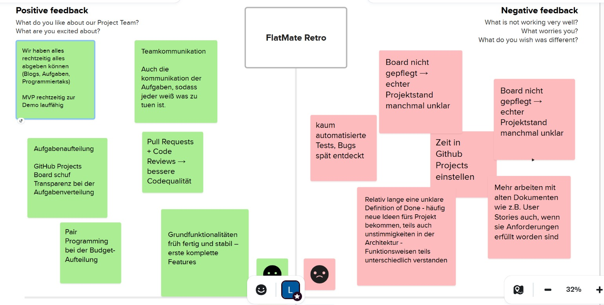
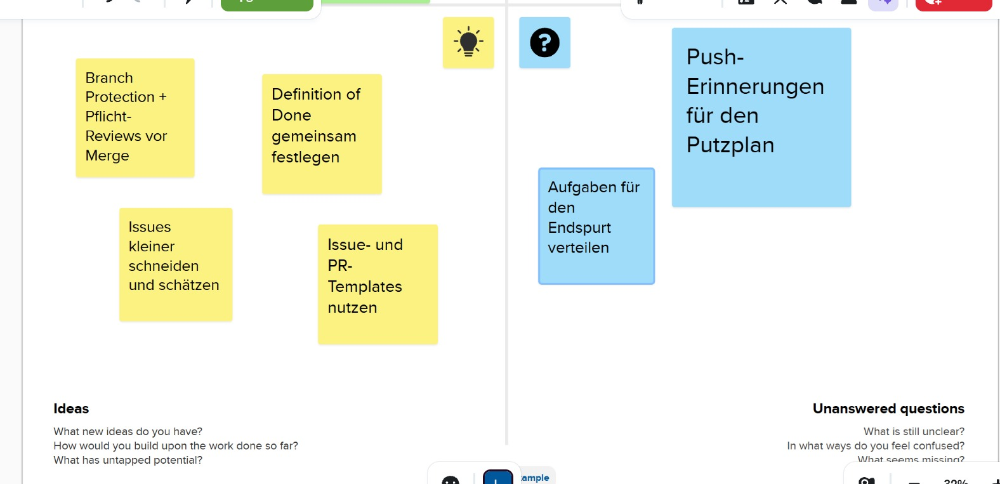

# Projekt-Retrospektive – FlatMate

## Metadaten

| Feld | Inhalt |
|---|---|
| **Datum** | Juni 2026 |
| **Tool** | Online-Kooperationsplattform (FlatMate Retro Board) |
| **Format** | 4-Felder-Retrospektive: Positive Feedback / Negative Feedback / Ideas / Unanswered Questions |
| **Teilnehmende** | Leon, Denis, Yaroslav, Mykyta, Kim |

---

## Board-Screenshots

### Positive Feedback & Negative Feedback

### Ideas & Unanswered Questions

---

## Zusammenfassung der Beiträge

### Was lief gut (Positive Feedback)

- Alles rechtzeitig abgegeben (Blogs, Aufgaben, Programmiertasks, MVP zur Demo fertig)
- Gute Teamkommunikation – klare Absprache, jeder wusste, was zu tun ist
- GitHub Projects Board schuf Transparenz bei der Aufgabenverteilung
- Pull Requests + Code Reviews führten zu höherer Codequalität und weniger Fehlern
- Pair Programming bei der Budget-Logik half bei komplexen Stellen
- Grundfunktionalitäten früh fertig und stabil – erste komplette Features früh lieferbar

### Was lief schlecht (Negative Feedback)

- **Board nicht konsequent gepflegt** → echter Projektstand manchmal unklar
- Kaum automatisierte Tests – Bugs wurden spät entdeckt
- Unklare Definition of Done: Neue Ideen kamen ständig rein, unterschiedliche Vorstellungen über Architektur und Funktionsweise
- GitHub-Board nicht konsequent gepflegt: Projektstand war zeitweise unklar
- **Zeit in GitHub Projects einstellen** – Aufwand dafür wurde unterschätzt
- Dokumente nicht konsequent weitergepflegt: User Stories und andere Artefakte wurden nach Erfüllung nicht mehr aktualisiert

### Ideas (Verbesserungsideen)

- **Branch Protection + Pflicht-Reviews** vor jedem Merge aktivieren
- **Definition of Done gemeinsam festlegen** – schriftlich und verbindlich
- Issues kleiner schneiden und schätzen
- Issue- und PR-Templates einführen für einheitlicheren Workflow

### Unanswered Questions (Offene Fragen)

- Faire Verteilung der letzten Aufgaben
- Push-Erinnerungen für den Putzplan noch umsetzen
- Aufgaben für den Endspurt verteilen

---

## Abgeleitete Maßnahmen für den Endspurt

Aus den besprochenen Punkten konnten die wichtigsten Maßnahmen abgeleitet werden:

| # | Maßnahme | Verantwortlich |
|---|---|---|
| 1 | **Definition of Done schriftlich festhalten** (Code + Tests + Doku + Review), um unterschiedliche Verständnisse zu vermeiden | Alle |
| 2 | **Branch Protection aktivieren** und mindestens ein Review pro Pull Request verpflichtend machen | Leon |
| 3 | **Board konsequent pflegen** und Zeit bzw. Aufwand direkt in GitHub Projects eintragen, damit der echte Stand jederzeit sichtbar ist | Alle |
| 4 | Issues kleiner schneiden sowie Issue-/PR-Templates einführen | Denis |
| 5 | Mehr **automatisierte Tests** schreiben, um Bugs früher zu entdecken | Alle |

---

## Fazit

Die Retrospektive macht deutlich, dass das größte Verbesserungspotenzial weniger in der Technik liegt, sondern in klareren Prozessen und verbindlicheren Absprachen. Besonders eine sauber definierte Definition of Done und ein kontinuierlicher CI/CD-Prozess sind entscheidend, um reibungsloser zusammenzuarbeiten. Mit den geplanten Maßnahmen gehen wir gut strukturiert und optimistisch in die letzten Projektwochen.
